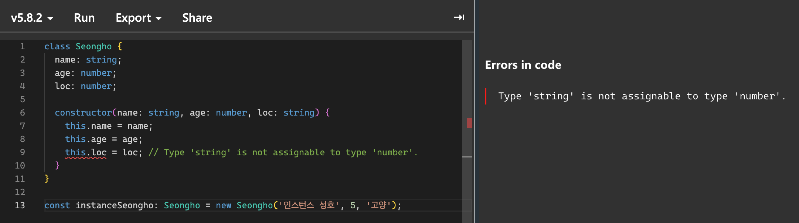
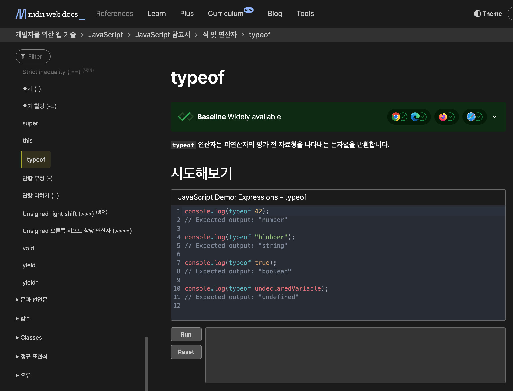

## 타입 애너테이션 방식
`타입에너테이션` <br />
-> 변수나 상수 혹은 함수의 인자와 반환값에 타입을 명시적으로 선언해서 어떤 타입 값이 저장될지 컴파일러에게 알려주는 문법.

타입스크립트는 변수 이름 뒤에 `: type` 구문을 붙여서 데이터 타입을 명시함.
```ts
const name: string = 'seongho';
const age: number = '27';
const list: number[]: [1, 2, 3];
```
ts는 기존 js코드에 점진적으로 타입을 적용할 수 있는 특징이 있어서 `: type` 구문을 제거해도 정상적으로 동작함. <br />
하지만 타입을 제거하면 ts의 타입 시스템이 타입을 추론하는 과정에서 어려움을 겪음; <br />

<br />

## 구조적 타이핑
타입을 사용하는 어러 언어에서는 어떤 값이나 객체는 하나의 구체적인 타입을 가지고 있음.
타입은 이름으로 구분되며, 컴파일 이후에도 남아있음. <br />
또한 서로 다른 클래스끼리 명확한 상속관계나 공통으로 가지고 있는 인터페이스가 없다면 타입은 서로 호환되지 않음.<br />
이것을 `명목적으로 구체화 한 타입 시스템`이라고 부르기도 함

근데 타입스크립트에서는 조금 다름.
타입스크립트는 이름으로 타입을 구분하는 명목적인 타입 언어와는 다르게 구조로 타입을 구분함. <br />
이를 `구조적 타이핑`이라고 함.

```ts
interface Man {
  name: string;
}

interface Woman {
  name: string;
}

let boy: Man = { name: 'seongho' };
let girl: Woman = { name: 'seulgi' };

boy = girl; // ✅
girl = boy; // ✅
```

<br />

## 구조적 서브 타이핑
타입스크립트의 타입 시스템은 집합으로 이해할수 있다고 했는데, 이처럼 타입은 단지 집합에 포함되는 값이고 특정 값은 많은 집합에 포함될 수 있음. <br />
따라서 타입스크립트에서는 특정 값이 `string` 또는 `number`타입을 동시에 가질 수 있음.
```ts
type StringOrNumber = string | number;
```

이처럼 집합으로 나타낼 수 있는 타입스크립트의 타입 시스템을 지탱하고 있는 개념이 바로 `구조적 서브타이핑` 임.<br />
**`구조적 서브타이핑`이란 객체가 가지고 있는 프로퍼티를 바탕으로 타입을 구분하는 것으로, 이름이 다른 객체라도 가진 프로퍼티가 동일하면 ts는 서로 호환이 가능한 동일한 타입으로 여긴다는 것임.**

<br />

```ts
interface Pet {
  name: string;
}

interface Dog {
  name: string;
  age: number;
}

let pet: Pet;
let dog: Dog = { name: '도크', age: 4 };

pet = dog; // ✅
```
**Pet**과 **Dog**는 서로 다른 타입으로 선언됬지만, **Pet**이 갖고있는 name이라는 프로퍼티를 **Dog**이 갖고있음.<br />
따라서 **Dog**타입으로 선언한 **dog**를 **Pet**타입으로 선언한 **pet**에 할당이 가능함.

이러한 개념은 매개변수에도 적용됨
```ts
interface Dog {
  name: string;
  age: number;
}

interface Pet {
  name: string;
}

const dog: Dog = { name:'무개력', age: 4 };

function getPetName(pet: Pet) {
  return pet.name;
}

getPetName(dog); // ✅
```
이게 가능한 이유는 **dog**객체는 **Pet**인터페이스가 갖고있는 **name**이라는 속성을 갖고 있어서 **pet.name**의 방식으로 name에 접근이 가능하기 때문임. <br />
이런 방식이 바로 `구조적 타이핑`임. 또다른 예시를 보자면

<br />

```ts
class Person {
  name: string;
  age: number;

  constructor(name: string, age: number) {
    this.name = name;
    this.age = age;
  }
}

class Developer {
  name: string;
  age: number;
  language: string;

  constructor(name: string, age: number, language: string) {
    this.name = name;
    this.age = age;
    this.language = language
  }
}

function foo(person: Person) {
  // ...
}

const dev: Developer = { name: 'seongho', age: 27, language: 'ts' };

foo(dev); // ✅
```
**Developer**클래스는 **Person**클래스는 상속받지 않았음에도 불구하고 `foo(dev)`가 에러 없이 정상적으로 동작함.
**Developer**클래스는 **Person**클래스가 갖고있는 모든 속성을 갖고있기 때문임.

**_이처럼 타입스크립트는 서로 다른 타입간의 호환성은 오로지 타입 내부의 구조에 의해서 결정됨._**<br />
따라서 타입이 계층 구조로부터 자유롭다는 특징이 있음.

<br />

## 자바스크립트를 닮은 타입스크립트
ts는 `구조적 서브타이핑`을 사용함. 이는 타입의 구조가 아닌 타입의 이름으로 구분을 하는 `명목적 타이핑`과는 대조되는 개념임.
```java
// Java
class Cat {
  String name;
    public void hit() {}
}

Class Arrow {
  String name;
    public void hit() {}
}

public class Main {
  public static void main(String[] args) {
    Arrow cat = new Cat(); // Error!

    Cat arrow = new Arrow(); // Error!
  }
}
```
-> ts에서는 가능한 코드가 명목적 타이핑을 사용하는 Java에서는 불가능함.
**이는 객체의 속성을 다른 객체의 속성과 호환되지 않도록 하여 안정성을 추구함.**

그런데도 ts는 왜 `구조적 서브타이핑`을 채택했을까?<br />
그거는 js가 본질적으로 **덕 타이핑**을 기반으로 하기 때문이고, ts는 js를 모델링한 언어이기 때문임.<br />

**_`덕 타이핑`이란 어떤 함수의 매개변숫값이 올바르게 주어진다면 그 값이 어떻게 만들어졌는지 신경쓰지 않고 사용한다는 개념임._**
ts는 이런 js의 `덕 타이핑` 방식을 그대로 받아들여서 이름을 가지고 타입을 구분하는게 아니라, 구조적 특징을 기반으로 타이핑 하는 방식을 채택한 것.

그렇다면 `덕 타이핑`과 `구조적 서브타이핑`의 차이는 무엇일까? 그 차이점은 타입을 검사하는 시점에 있음.

- **덕 타이핑**<br />
런타임에 타입을 검사함

<br />

- **구조적 타이핑**<br />
컴파일 타임에 타임 체계가 타입을 검사함.

> [!NOTE]
> **_덕 타이핑_**<br />
> 어떤 타입에 부합하는 변수와 메서드를 가질 경우, 해당 타입에 속하는 것으로 간주하는 방식.<br />
> _**'만약, 어떤 새가 오리처럼 걷고, 헤엄치며 꽥꽥거리는 소리를 낸다면 나는 그 새를 오리라고 부를것이다.'**_

<br />

## 구조적 타이핑의 결과
근데 이런 유연함 때문에 예기치 못한 결과가 나오기도 함
```ts
interface Cube {
  width: number;
  height: number;
  depth: number;
}

function addLines(c: Cube) {
  let total = 0;

  for (const axis of Object.keys(c)) { // 경고!!!!!!!!!!!!!!!!!
    const length = c[axis];

    total += length;
  }
}
```
왜 이럴까?<br />
이는 ts가 구조적 타이핑의 성격을 띄기 때문에, `Cube`의 `width`, `height`, `depth`이외에도 어떤 속성이든 갖고있을 수 있어서 `c[axis]`의 타입이 `number`가 아닌 다른것일 수도 있어서 에러가 발생하는 것.
```ts
interface Cube {
  width: number;
  height: number;
  depth: number;
}

function addLines(c: Cube) {
  let total = 0;

  for (const axis of Object.keys(c)) { // 경고!!!!!!!!!!!!!!!!!
    const length = c[axis];

    total += length;
  }
}

addLines({
  width: 10,
  height: 10,
  depth: 10,
  name: 'cube'
}); // OK
```
이런 거지 <br />

이런 한계를 극복하기 위해서 ts는 `유니온` 같은 방법이 생겼음.

<br />

## 타입스크립트의 점진적 타입 확인
ts는 점진적으로 타입을 확인하는 언어임.
`점진적 타입 검사`란 **_컴파일 타임에 타입을 검사하면서 필요에 따라 타입 선언 생략을 허용하는 방식._**
타입 어노테이션 방식으로 지정해주면 정적으로 타입을 검사하지만 타입 선언이 생략되면 동적으로 타입 검사를 수행함.<br />
타입 선언을 생략하면 암시적인 타입 변환이 일어남
```ts
function add(x, y) {
  return x + y;
}
```
이렇게 적으면 ts는 아래처럼 타입을 암시적으로 변환시킴
```ts
function add(x: any, y: any): any;
```
타입을 명시하지 않아서 ts는 모두 `any`타입으로 추론하는 것임.<br />
이처럼 ts는 필요에 따라서 타입을 생략할 수 있는데, 이를 ts가 갖고있는 `점진적 타이핑` 이라고 하는 특징임. 이를 활용해서 `js`에서 `ts`로 마이그레이션 할때 점진적으로 진핼할 수 있는 것.

> [!NOTE]
> **_any 타입_**<br />
> ts의 모든 타입을 포함하는 가장 상위 타입으로, 어떤 값이든 할당할 수 있음.<br />
> `tsconfig`의 `noImplicitAny`를 `true`로 켜두면 타입 애너테이션이 없을때 ts가 암묵적으로 `any`로 추론하는 것을 허락하지 않을 수 있음.

<br />

## 자바스크립트의 슈퍼셋으로서의 타입스크립트
ts는 기존의 js코드에 정적인 타이핑을 추가한 것으로 js의 상위집합임.<br />
따라서 모든 js코드는 ts지만, 모든 ts가 js인것은 아님.
```ts
// ts
function add(x: number, y: number): number {
  return x + y;
}

// js
function add(x: number, y: number): number {
  return x + y;
} // Error!
```

<br />

## 값 vs 타입
`값` 이란?<br />
-> 프로그램이 처리하기 위해 메모리에 저장하는 모든 데이터.<br />
어떤한 식을 연산한 것으로 변수에 할당할 수 있음.
```ts
11; // 값
'hello world'; // 값
const foo = 'bar'; // 값
const getName = function (name) {
  return name;
} // js에서는 함수도 값임.
```

<br />

ts에 들어오면서 **'타입'** 이라는 개념이 등장함.
ts는 변수, 매개변수, 객체 속성 등에 `: type`으로 타입을 명시함.<br />
```ts
const a: string = 'name';
const b: number = 12;
...
```
또는 `type`이나 `interface` 키워드로 커스텀 타입을 정의할 수 있음.
```ts
interface Person {
  name: string;
  age: number;
}

type Person = {
  name: string;
  age: number;
};
```
ts는 컴파일을 하게 되면 타입 관련 부분들에 전부 제거되고, js파일만 남게 되기 때문에
**_값 공간_**과 **_타입 공간_**은 서로 충돌하지 않음. 이러한 특징 때문에 타입과 변수를 같은 이름으로 지어도 문제가 되지 않음.

보통 타입과 값을 구분하는 것은 어렵지 않음. 값은 `=` 으로, 타입은 `:` 또는 `as`로 작성함.
```ts
interface Developer {
  name: string;
  isWorking: boolean;
}

const developer: Developer = { name: 'seongho', isWorking: true };
```
-> 여기서 `Developer`는 타입, `{ name: 'seongho', isWorking: true }`는 값임.

```ts
function information(name: string, age: number) {
  // ...
}
```

<br />

근데 ts는 값과 타입의 구분은 맥락에 따라서 달라지기 때문에 값공간과 타입 공간을 혼동할때가 있는데, 이를 주의해야 함.
js의 Destructuring을 사용하면 객체를 풀어서 받을 수 있음
```ts
// js
function information({ person, name, age }) {
  // ...
}
```
근데 같은 코드를 ts에서 쓰면 오류가 발생함.
```ts
function information({
  person: Person
  string,
  string,
}) {
    // ...
}
```
<br />

이는 값의 관점에서 `Person`과 `string`이 해석됬기 때문임. <br />
개발자의 의도는 `person`을 `Person`타입으로, `name`과 `age`를 `string`타입으로 설정하려고 했으나 `Person`과 `string`이 값 공간에 있는 것으로 해석됬기 때문임.
따라서 ts에서는 위 코드와 같은 값-타입 공간을 혼동하는 문제를 해결하기 위해 값과 타입을 구분해서 작성해야 함.
```ts
function information({
  person,
  name,
  age
}: {
  person: Person;
  name: string;
  age: string;
}) {
  // ...
}
```

<br />

## class와 enum
ts에서는 값과 타입 공간이 동시에 존재하는 심볼도 있음. <br />
대표적으로 `class`와 `enum`이 있음. 클래스는 인스턴스 객체를 쉽게 생성하기 위한 문법으로 실제 동작은 생성자 함수와 같음.`(syntantic sugar)`<br />
그와 동시에 클래스는 타입으로도 사용 됨
```ts
class Seongho {
  name: string;
  age: number;

  constructor(name: string, age: number) {
    this.name = name;
    this.age = age;
  }
}

const instanceSeongho: Seongho = new Seongho('인스턴스 성호', 5);
```
-> 여기서 `Seongho는` **타입**으로도 사용되고, 생성자 함수인 **값**으로도 사용 되었음.



클래스를 작성할 경우 클래스 내부 타입 선언과, 넘겨줄 인자의 타입은 동일해야 한다는 점 (어찌보면 당연한 말이지만..)

<br />

클래스와 마찬가지로 `enum`또한 런타임에 객체로 변환됨. enum은 ts에서 제공하는 기능으로, js에 존재하지는 않음.
enum으로 작성한 코드를 컴파일 하면
```js
var Seongho;
(function (Seongho) {
    Seongho[Seongho["name"] = 0] = "name";
    Seongho[Seongho["age"] = 1] = "age";
    Seongho[Seongho["location"] = 2] = "location";
})(Seongho || (Seongho = {}));
```
이러한 형태가 됨.
`enum`도 클래스와 동일하게 js런타임에서 실제 값으로 사용될 수 있음.<br />
예시를 봐보자

<br />

```ts
enum UserResponse {
  No = 0,
  Yes = 1,
}

function getResponse(res: { Yes: number }) {
  return res;
}

getResponse(UserResponse);
```
<br />

#### 타입스크립트에서 자바스크립트의 키워드가 해석되는 방식

|키워드|값|타입|
|----|--|---|
|`class`|Y|N|
|`const` `let`, `var`|Y|N|
|`enum`|Y|Y|
|`function`|Y|N|
|`interface`|N|Y|
|`type`|N|Y|
|`namespace`|Y|N|

<br />

## 타입을 확인하는 방법
ts에서는 `typeof`, `instanceof`, `타입 단언`을 활용해서 타입을 확인할 수 있음.
- `typeof`<br />
  7가지 기본 데이터 타입, Function, 호스트 객체, object객체가 될 수 있음<br />
  ```ts
  typeof 2022; // number
  typeof 'abc'; // string;
  typeof {}; // object
  ```

**_근데 주의할 점은 `typeof`연산자는 값에서 쓰일때와 타입에서 쓰일때의 역할이 다름._**
- `값에서 사용된 typeof`는 js런타임의 `typeof`로 사용됨. (js의 typeof연산자로 사용된다는 뜻)
   <br />
  -> 요놈 <br />
   <br />
  ```ts
  interface Person {
    name: string;
  }
  const person = new Person('seongho');
  const func = () => {};

  const v1 = typeof person; // 'object'
  const v2 = typeof func; // 'function'
  ```
- `타입에서 사용된 typeof`는 값을 읽고 ts의 타입을 반환함.
  ```ts
  type t1 = typeof person; // Person
  type t2 = typeof func; // () => void
  ```
  `person`은 변수가 `Person`타입으로 선언되었기 때문에 **_타입 공간에서의 `typeof person`은 `Person`을 반환함._** <br />
  `func`는 **_타입 공간에서 `typeof`로 값을 읽으면 `함수 시그니처 타입`을 반환함._**

 <br />

ts에서는 `타입 단언`이라고 부르는 문법을 통해서 타입을 강제할 수도 있음. `as`키워드를 사용하면 됨
```ts
const num: number;

function getString(str: string) {
  // ...
}

getString(num as string);
```
-> num은 number타입이지만 string으로 `타입 단언`을 시켜서 getString의 인자로 넘겨줌..