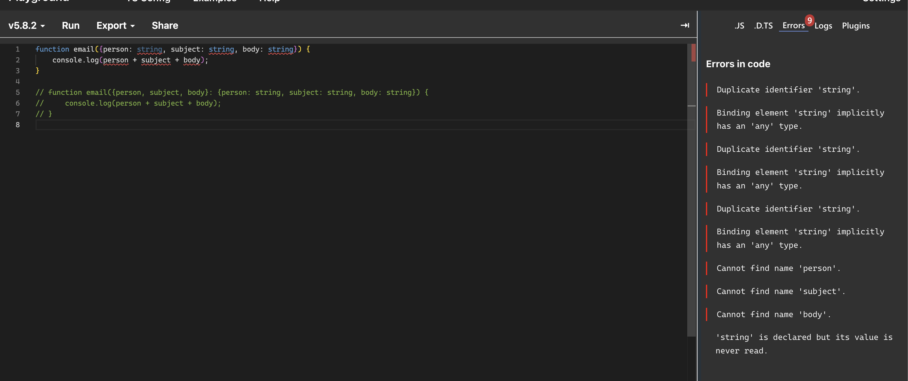
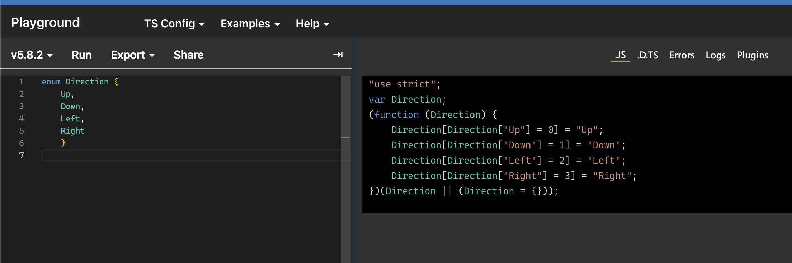

# 타입스크립트의 타입 시스템

## 1) 타입 애너테이션 방식

### 타입 애너테이션(type annotaion)?

변수나 상수 혹은 함수의 인자와 반환 값에 타입을 명시적으로 선언해서 어떤 타입 값이 저장될 것인지를 컴파일러에 직접 알려주는 문법이다.

```ts
let isDone: boolean = false;
const CHU: string = "seulgi";
```

타입 스크립트에서는 변수 이름 뒤에 `: type` 구문을 붙여 데이터 타입으 명시해준다.<br />
`: type` 선언부를 제거해도 코드가 정상적으로 동작하지만 타입 시스템이 타입 추론을 하는 과정에 어려움을 겪을 수도 있다.

<br />
<br />

## 2) 구조적 타이핑

### 명목적 구체화 타입 시스템(Nominal Reified Type System)?

값이나 객체는 하나의 구체적인 타입을 가지고 있다. <br />
타입은 이름으로 구분되며 컴파일타임 이후에도 남아있다.

```cpp
class Animal {
    String name;
    int age;
}
```

서로 다른 클래스끼리 명확한 상속 관계나 공통으로 가지고 있는 인터페이스가 없다면 타입은 서로 호환되지 않는다.

### 구조적 타이핑(Structural Type System)?

타입스크립트에서 타입을 구분하는 방식은 이름으로 타입을 구분하는 명목적인 타입 언어의 특징과 달리 타입스크립트는 구조로 타입을 구분하는 것을 구조적 타이핑이라 한다.

<br />
<br />

## 3) 구조적 서브타이핑

타입스크립트의 타입은 값의 집합(set of values)으로 생각할 수 있다.
타입은 단지 집합에 포함되는 값이고 특정 값은 많은 집합에 포함될 수 있다.

> 따라서 타입스크립트에서는 특정 값이 string 또는 number 타입을 동시에 가질 수 있다.

### 구조적 서브타이핑(Structural Subtyping)?

집합으로 나타낼 수 있는 타입스크립트의 타입 시스템을 지탱하고 있는 개념이 바로 구조적 서브타이핑이다.

객체가 가지고 있는 속성(프로퍼티)을 바탕으로 타입을 구분하는 것이다. 이름이 다른 객체라도 가진 속성이 동일하다면 타입스크립트는 서로 호환이 가능한 동일한 타입으로 여긴다.

```ts
interface Pet {
  name: string;
}

interface Cat {
  name: string;
  age: number;
}

let pet: Pet;
let cat: Cat = { name: "Chu", age: 2 };

// ✅ OK!
pet = cat;
```

> Cat, Pet는 다른 타입으로 선언되었지만 Pet이 갖고 있는 속성을 가지고 있어,<br /> Cat 타입으로 선언한 cat도 Pet타입에 선언한 pet에 할당할 수 있다.

```ts
interface Pet {
  name: string;
}

interface Cat {
  name: string;
  age: number;
}

let cat: Cat = { name: "Chu", age: 2 };

function greet(pet: Pet) {
  console.log("Hello" + pet.name);
}

greet(cat); // ✅ OK!
```

> cat 객체는 Pet 인터페이스가 가지고 있는 name 속성을 가지고 있어 pet.name 방식으로 name 속성에 접근할 수 있는 타이핑 방식을 지원한다.( = 구조적 타이핑)

### 서로 다른 두 타입 간이 호환성은 타입 내부의 구조에 의해 결정된다.

타입 A가 타입 B의 서브타입이라면 A 타입의 인스턴스는 B 타입이 필요한 곳에 언제든지 위치할 수 있다. 즉 타입이 계층 구조로부터 자유롭다.

<br />
<br />

## 4) 자바스크립트를 닮은 타입스크립트

명목적 타이핑을 채택한 언어에서는 이름으로 타입을 구분하기 때문에 구조가 같더라도 이름이 다르다면 다른 타입으로 취급한다. 명목적 타이핑은 타입의 동일성을 확인하는 과정에서 구조적 타이핑에 비해 조금 더 안전하다.

즉, 객체의 속성을 다른 객체의 속성과 호환되지 않도록 하여 안전성을 추구한다.

### 그럼에도 타입스크립트가 구조적 타이핑을 채택한 이유가 뭘까?

타입스크립트가 자바스크립트를 모델링한 언어이기 때문이다.<br />
자바스크립트는 본질적으로 **덕 타이핑(duck typing)** 을 기반으로<br />
타입스크립트는 이런 동작을 그대로 모델링한다.

> **덕 타이핑(duck typing)?** <br />
> 어떤 함수의 매개변숫값이 올바르게 주어진다면 그 값이 어떻게 만들어졌는지 신경 쓰지 않고 사용한다는 것이다. 어떤 타입에 부합하는 변수와 메서드를 가질 경우 해당 타입에 속하는 것. "만약 어떤 새가 오리처럼 걷고 헤엄치며 꽥꽥거리면 그 새도 오리다"

구조적 타이핑 덕분에 타입스크립트는 더욱 유연한 타이핑이 가능해지고,<br />
쉬운 사용성과 안정성이라는 두 가지 목표 사이의 균형을 중시하는 타입스크립트에서는<br />
객체 간 속성이 동일하다면 서로 호환되는 구조적 타입 시스템을 제공해 편리성을 높였다.

### 덕 타이핑과 구조적 타이핑의 차이는?

타입을 검사하는 시점에서 차이가 있다. <br />
덕 타이핑은 런타임, 구조적 타이핑은 컴파일 타임에 타입을 검사한다.

> 두 타이핑 모두 객체 변수, 메서드 같은 필드를 기반으로 타입을 검사한다는 점에서는 동일하지만 타입을 검사하는 시점이 다르다.

<br />
<br />

## 5) 구조적 타이핑의 결과

구조적 타이핑의 특징 때문에 예기치 못한 결과가 나올 수 있다.

```ts
interface Cube {
  width: number;
  height: number;
  depth: number;
}

function addLines(c: Cube) {
  let total = 0;

  for (const axis of Object.keys(c)) {
    const length = c[axis];

    total += length;
  }
}

// Error: Element implicitly has an 'any' type because expression of type 'string' can't be used to index type 'Cube'. No index signature with a parameter of type 'string' was found on type 'Cube'.
```

> c에 들어올 객체는 Cube의 width, height, depth 속성 외에도 어떤 속성이든 가질 수 있기 때문에 c[axis] 타입이 string일 수 있어 에러가 발생한다.

이러한 한계를 극복하고자 **타입스크립트에 명목적 타이핑 언어의 특징을 가미한 식별할 수 있는 유니온(Discriminated Unions) 같은 방법이 생겨났다.**

<br />
<br />

## 6) 타입스크립트의 점진적 타입 확인

타입스크립트는 점진적으로 타입(gradually typed)을 확인하는 언어이다.

### 점진적 타입(gradually type) 검사?

컴파일타임에 타입을 검사하면서 필요에 따라 타입 선언 생략을 허용하는 방식이다.<br />
타입 선언이 생략되면 동적으로 검사를 수행하고 암시적 타입 변환이 일어난다.

이처럼 타입스크립트에서는 필요에 따라 타입을 생략할 수도 있고 타입을 점진적으로 추가할 수도 있다.
그러나 타입스크립트는 컴파일타임에 프로그램의 모든 타입을 알고 있을 때 최상의 결과를 보여준다.

### any 타입?

타입스크립트 any 타입은 모든 타입의 종류를 포함하는 상위 타입으로 어떤 타입 값이든 할당할 수 있다.
단, 타입스크립트 컴파일 옵션인 noImplicitAny 값이 true일 때는 에러가 발생한다.

<br />
<br />

## 7) 자바스크립트 슈퍼셋으로서의 타입스크립트

타입스크립트는 자바스크립트의 상위 집합으로 모든 자바스크립트 문법을 포함하고 있다.
모든 타입스크립트 코드가 자바스크립트 코드인 것은 아니고, 타입스크립트는 타입을 명시하는 뭄법을 가지고 있기 때문이다.

<br />
<br />

## 8) 값 vs 타입

### 값의 특징을 알아보자.

- 값은 프로그램이 처리하기 위해 메모리에 저장하는 모든 데이터이다.
- 프로그래밍 관점에서는 문자열, 숫자, 변수, 매개변수 등이 값에 해당된다.
- 객체 역시 값이며 함수도 역시 런타임에 객체로 변환되기 때문에 값이다.
- 값은 어떠한 식을 연산한 것으로 변수에 할당할 수 있다.

> 자바스크립트 대신 타입스크립트를 사용하게 되면서 타입이라는 개념이 등장한다. <br />
> 타입스크립트는 변수, 매개변수, 객체 속성 등에 : type 형태로 타입을 명시한다.

### 값과 다른 타입의 특징을 알아보자.

- type, interface 키워드로 커스텀 타입을 정의할 수 있다.
- 타입스크립트 문법인 type으로 선언한 내용은 자바스크립트 런타임에서 제거되기 때문에 값 공간과 타입 공간은 서로 충돌하지 않는다.
- 타입은 주로 타입 선언(:), 단언 문(as)로 작성하고 값은 할당 연산자인 =으로 작성한다.
- 함수의 매개변수처럼 여러 개의 심볼이 함께 쓰이면 타입과 값을 명확하게 구분해야 한다.
- 값이 사용되는 위치와 타입이 사용되는 위치가 다르기에 코드가 어디에서 사용되었는지에 따라 추론할 수 있다.

> 이처럼 타입스크립트에서는 값과 타입이 함께 사용되고, 값과 타입은 타입스크립트에서 별도의 네임스페이스에 존재한다.

### 값 공간과 타입 공간을 혼동할 때도 있다!

```ts
function email({ person: string, subject: string, body: string }) {
  console.log(person + subject + body);
} // Error!

// ✅ 올바른 예시
function email({
  person,
  subject,
  body,
}: {
  person: string;
  subject: string;
  body: string;
}) {
  console.log(person + subject + body);
}
```



- 값의 관점에서 Person과 string이 해석되어 오류가 발생했다.
- person과 Person은 각 함수의 매개변수 객체 내부 속성의 키-값에 해당하는 것으로 해석한다.

> 이와 같은 값-타입 공간으로 혼동하는 문제를 해결하기 위해 값과 타입을 구분해서 작성해야 한다.

### 값과 타입 공간에 동시에 존재하는 심볼도 있다!

대표적인 것이 클래스와 enum이다. 클래스는 객체 인스턴스를 더욱 쉽게 생성하기 위한 문법 기능으로 실제 동작은 함수와 같다.

클래스는 타입으로도 사용되고, 타입스크립트 코드에서 클래스는 값과 타입 공간 모두에 포함될 수 있다.

```ts
class Developer {
  name: string;
  domain: string;

  constructor(name: string, domain: string) {
    this.name = name;
    this.domain = domain;
  }
}

const me: Developer = new Developer("chu", "frontend");
```

- 변수명 me 뒤의 `Developer`는 타입에 해당한다.
- `new` 키워드 뒤의 `Developer`는 클래스 생성자 함수인 값으로 동작한다.

### enum 역시 값, 타입 둘 다 가능하다.

enum 역시 런타임에 객체로 변환되는 값이다. 런타임에 실제 객체로 존재하며, 함수로 표현할 수 있다.



> enum도 클래스처럼 타입 공간에서 타입을 제한하는 역할을 하지만 자바스크립트 런타임에서도 실제 값으로 사용될 수 있다.

```ts
enum WeekDays {
  MON = "Mon",
  TUES = "Tues",
  WEDNES = "Wednes",
  THURS = "Thurs",
  FRI = "Fri",
}

// "MON" | "TUES" | "WEDNES" | "THURS" | "FRI"
type WeekDayKey = keyof typeof WeekDays;

function printDay(key: WeekDayKey, message: string) {
  const day = WeekDays[key];

  if (day <= WeekDays.WEDNES) {
    console.log(`It's still ${day}day, ${message}`);
  }
}

printDay("TUES", "wanna go home");
```

> 해당 enum이 타입으로 사용되었다. keyof typeof 연산자를 사용해 타입을 만들어, 값의 타입을 제한하는 방식으로 사용했다.

```ts
enum MyColors {
  BLUE = "#0000FF",
  PINK = "#FF00FF",
}

function whatPinkColor(colors: { PINK: string }) {
  return colors.PINK;
}

whatPinkColor(MyColors); // ✅
```

> 해당 예시예서 enum을 일반 객체처럼 동작한다.

### 정리

타입스크립트에서 어떠한 심볼이 값으로 사용된다는 것은 컴파일러를 사용해서 타입스크립트 파일을 자바스크립트 파일로 변환해도 여전히 자바스크립트 파일에 남아있음을 의미한다.

타입으로만 사용되는 요소는 컴파일 이후에 자바스크립트 파일에서 사라진다.

### 타입스크립트에서 자바스크립트의 키워드가 해석되는 방식

| 키워드          | 값  | 타입 |
| --------------- | --- | ---- |
| class           | Y   | Y    |
| const, let, var | Y   | N    |
| enum            | Y   | Y    |
| function        | Y   | N    |
| interface       | N   | Y    |
| type            | N   | Y    |
| namespace       | Y   | N    |

<br />
<br />

## 9) 타입을 확인하는 방법

`typeof`, `instanceof` 그리고 `타입 단언`을 사용해서 타입을 확인할 수 있다.

### typeof

- 연산하기 전에 피연산자의 데이터 타입을 나타내는 문자열을 반환한다.
- typeof가 반환하는 값은 자바스크립트 7가지 기본 데이터 타입이 될 수 있다.
- 타입스크립트에서는 값 공간과 타입 공간이 별도로 존재한다.(역할이 각각 다름)

```ts
interface Person {
  first: string;
  last: string;
}

const person: Person = {
  first: "seulgi",
  last: "chu",
};

function email(options: { person: Person; subject: string; body: string }) {
  console.log(options);
}

const v1 = typeof person; // 값은 "object"
type T1 = typeof person; // 타입은 Person

const v2 = typeof email; // 값은 "function"
type T2 = typeof email; // 타입은 (ontions; {person: Person; subject: string; body: string; }) => void
```

> 값으로서 typeof : 자바스크립트 런타임의 typeof 연산자,<br />
> 타입에서 사용된 typeof : 값을 읽고 타입스크립트 타입을 반환한다.

email 함수는 타입 공간에서 typeof 연산자로 값을 읽을 때 함수의 매개변수 타입과 리턴 타입을 포함한 함수 시그니처 타입을 반환한다.

### 자바스크립트 클래스에서 typeof 연산자 사용에 주의하자!

```ts
class Developer {
  name: string;
  sleepingTime: number;

  constructor(name: string; sleepingTime: number) {
    this.name = name;
    this.sleepingTime = sleepingTime;
  }
}

const d = typeof Developer; // 값이 "function"
type T = typeof Developer; // 타입이 typeof Developer
```

> 타입 공간에서 typeof Developer 반환값은 "typeof Developer"인데 type T에 할당된 Developer는 인스턴스 타입이 아니라 new 키워드를 사용할 때 볼 수 있는 생성자 함수이기 때문이다.

### instanceof

자바스크립트에서 instanceof 연산자를 사용하면 프로토타입 체이닝 어딘가 생성자 프로토타입 속성이 존재하는지 판단할 수 있다.

instanceof 연산자의 필터링으로 타입이 보장된 상태에서 안전하게 값의 타입을 정제하여 사용할 수 있다.

```ts
let error = unknown;

if (error instanceof Error) {
  // 로직
} else {
  throw Error(error);
}
```

### 타입 단언

타입을 강제할 수 있는데 `as` 키워드를 사용해 타입 단언을 한다.

타입 단언은 개발자가 해당 값의 타입을 더 잘 파악할 수 있을 때 사용되며 강제 형 변환과 유사한 기능을 제공한다.

> 타입스크립트는 컴파일 단계에서 타입 단언이 형 변환을 강제할 수 있지만 런타임에서는 효력을 발휘하지 못한다. 이외에도 타입을 검사하는 다른 방법으로 타입 가드가 있다. (특정 조건을 검사해 타입을 정제하고 타입 안정성을 높이는 패턴)
