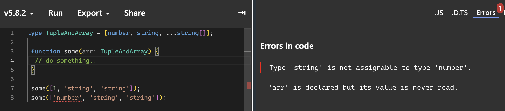

## 타입스크립트만의 독자적 타입 시스템
ts에서 내포하고 있는 개념은 모두 js에서 기인한 것 임 <br />
ts의 `any`타입을 살펴보자. js에서 변수 타입을 아무리  추적해봐도, any라는 문자열을 반환하는 경우는 찾을 수 없음. `any`는 ts만의 독자적인 타입 시스템이기 때문. <br />

타입스크립트의 타입 계층구조는 아래와 같음.


<br />

### 1. `any`타입
any타입은 앞서 말한대로 js에 존재하는 모든 값을 오류없이 받을 수 있음. <br />
따라서 any로 지정한 타입에 어떠한 값을 할당하더라도 오류가 발생하지 않음.
```ts
let a: any;

a = 1;
a = 'Hello';
a = () => {};
a = {};
```
이러한 any는 사실 ts의 정적 타이핑의 방향과는 맞지 않기때문에 최대한 사용을 지양해야 함.<br />
하지만 어쩔수 없는 환경이라는 것이 있는 법. 대표적으로 3가지 경우가 있음.

- **개발 단계에서 임시로 값을 지정해야 하는 경우**<br />
  아직 API의 세부 스펙이 나오지 않았거나, 확정되지 않았을 경우 `any`타입을 임시로 할당해 준 뒤, 이후 세부 스펙이 나왔을 때 다른 타입으로 대체하는 경우가 많음.

<br />

- **어떤 값을 받아올지 또는 넘겨줄지 정할 수 없을 경우**<br />
  _API 요청 및 응답 처리_, _콜백함수 전달_, _타입이 잘 정제되지 않아 파악이 힘든  외부 라이브러리_ 를 사용하는 경우 `any`타입을 사용할 수 있음.

  ```ts
  type ModalParams = {
    show: boolean;
    content: string;
    action?: any;
  }
  ```
  `ModalParams`를 보면 `action`타입이 `any`로 선언되어져 있는데, 모달의 특성상 모든 액션에 인자의 갯수나, `return`값을 모두 명시해줄 수 없을 때 `any`를 사용할 수 있음.

<br />

- **값을 예측할 수 없을 경우 암묵적으로 사용** <br />
  fetch와 API는 요청 이후 응답을 특정 포맷으로 파싱하는데, 이때 반환 타입이 any로 매핑되어져 있음.
  ```ts
  async function fetchAPI() {
    const res = await fetch('https://api.com');
    const data = await res.json(); // res.json()의 타입은 Priomise<any>

    return data;
  }
  ```

<br />

> [!WARNING]
> `any`타입은 편의성과 확장성을 제공하지만 컴파일러가 에러를 잡지 못하기 때문에 실제 런타임에서 심각한 오류가 발생할 수 있으니, 최대한 사용을 지양하자

<br />

### 2. `unknown` 타입
`unknown`타입은 `any`타입과 유사하게 모든 타입의 값이 할당 될 수 있음.
**_그러나 unknown타입으로 선언된 값은 any를 제외하고, 다른 타입으로 선언된 변수에 할당할 수 없음_**

> [!NOTE]
> **`any` vs `unknown`** <br />
> | any | unknown |
> |--|--|
> | - 어떤 타입이든 any에 할당 가능 <br /> - `any`타입으로 선언된 변수는 어디든 할당 가능 | - 어떤 타입이든 unknown에 할당 가능 <br /> - `unknown`타입으로 선언된 변수는 any타입 외에 다른 타입으로 선언된 변수에 할당 불가능 |
>
> 

<br />

`unknown`의 특징은 함수를 unknown타입에 할당할때는 컴파일러가 경고를 주지는 않지만, 실행하려고 하면 에러가 발생함.

-> 원시값의 사용은 에러를 뱉지 않지만 함수, 객체, 배열로 접근하려고 하면 에러를 뱉음

앞서, `any`를 사용하는 경우중에 어떤 값이 할당될지 파악하기 어려운 상황에서 `any`타입을 임시로 지정하여 개발하다가, 추후 any타입을 수정해야 하는 것을 **깜빡하고 누락하면** 큰일이 발생함.<br />
타입이 식별된 후에 사용이 가능한 unknown타입은 이런 불상사를 보완하기 위해서 등장한 타입임.<br />
따라서 `any`타입 대신에 `unknown`으로 대체해서 사용하는 방법이 권장 됨.

<br />

### 3. `void` 타입
함수가 아무것도 반환하지 않는 경우에 사용하는 타입. (함수가 아닌 곳에서도 할당이 가능하지만, 무의미함)
```ts
function runCallback(callback: CallbackType): void {
  callback();
}
```
js에서 아무것도 리턴하지않으면 암묵적으로 `undefined`를 리턴하지만 이건 `void`와는 다름. <br />
명시적인 의미를 부여하는 관점에서 `undefined`와 `null`, `void`를 의미에 맞게 사용하자.

<br />

### 4. `never` 타입
never타입도 일반적으로 함수와 관련해서 많이 사용되는 타입으로서, **값을 반환할 수 없는 타입**을 말함.<br />
여기서 중요한 건 반환을 **`안`하는 거**랑 **`못`하는 거**를 명확히 구분 해야 함.
**못하는 경우**는 대표적으로 두가지 경우가 있음.
- 에러를 던지는 경우<br />
  ```ts
  function generateError(): never {
    throw new Error();

    // ...
  }
  ```
- 무한히 함수가 실행되는 경우(infinity loop)<br />
  ```ts
  function infiniteLoop(): never {
    while (true) {
      // do something..
    }
  }
  ```
<br />

`never`타입은 모든 타입의 하위 타입으로서 never로 선언된 변수에는 어떠한 타입도 할당될 수 없음.
ts에서는 조건부 타입을 결정할 때 엄격한 타입검사 목적으로 never타입을 명시적으로 사용하기도 함.

<br />

### 5. `Array`타입
js에서의 배열은 동적 언어의 특징에 따라 어떤 값이든 배열의 원소로 허용함.

```tsx
function fn() {};

const arr = [1, "string", fn];
```

하지만 이런 개념은 ts의 정적타이핑에 부합하지 않음.

따라서 ts에서는 배열의 크기까지 제한하지는 않지만, 정적타입의 특성을 살려
명시적인 타입을 선언하여 해당 타입의 원소를 관리하는 것을 강제함.

```ts
const arr: number[] = [1, 2, 3];
```

→ 숫자에 해당하는 원소만 허용함.<br />
Array는 `제네릭`이라는 특수한 문법으로도 선언이 가능함.

```ts
const arr: Array<number> = [1, 2, 3];
```

두 선언방식의 차이점은 없음.<br />
만약, 여러 타입을 모두 관리해야 하는 배열을 선언하려면 `유니온 타입`을 사용할 수 있음

```ts
const arr: Array<number | string> = [1, "string"];
const arr2: (number | string)[] = [1, "string"];
```

<br />

그러나 여기에 **배열의 길이**까지 제한하고 싶다면 `튜플` 이라고 하는 타입 시스템을 사용할 수 있음.
튜플은 배열의 길이까지 제한하여 **원소타입**과, **갯수**를 보장함.
```ts
let tuple: [number] = [1];

tuple = [1, 2]; // Error!
tuple = ['string']; // Error!

let tuple2: [number, string] = [1, 'string']; // ✅
```
튜플은 컨벤션을 잘 지키고, 배열 원소의 명확한 의미와 쓰임을 보장하면 더욱 안전하게 사용할 수 있음.

***예를 들어 리액트의 `useState` 훅을 살펴보자.*** <br />
`useState훅`은 튜플 타입을 반환함.
`첫번째 원소`는 훅으로부터 생성 및 관리되는 상태 값을 의미하고, `두번째 원소`는 해당 상태를 조작할 수 있는 setter를 의미함.
또한 `구조 분해 할당`을 사용해서 사용자가 자유롭게 이름을 정의할 수 있음. <br />
`useState`는 **반환값이 명확**하고, **잘 설계된 API**이므로 `튜플` 타입을 통해서 유연성을 얻을 수 있음.

 <br />

 튜플과 배열의 성질을 혼합해서 사용할 수도 있는데 일부는 튜플로 엄격하게 제한하고, 나머지는 배열처럼 동작하게 할 수도 있음.
 ```ts
 // 첫번째 원소는 number타입, 나머지는 string만 올 수 있음
 type TupleAndArray = [number, string, ...string[]];

 function some(arr: TupleAndArray) {
  // do something..
 }
 ```
 

> [!TIP]
> **`옵셔널(optional)`** <br />
> 선택적으로 속성을 명시하고 싶다면 물음표 기호(`?`)와 함께 해당 속성을 선언할 수 있음. <br />
> 이는, 옵셔널하기 때문에 필수적으로 자리잡고 있지 않을 수 있음을 의미함.
> ```tsx
> const arr: [number, string, boolean?] = [1, "Hello"];
> ```

<br />

### 6. `enum` 타입
enum타입은 `열거형`이라고도 부르는데, ts에서 지원하는 특수한 타입임.
enum을 사용해서 열거형을 정의할 수 있는데 열거형은 각각의 `멤버` 라는 것을 가짐.<br />
약간 객체와 비슷한데, **_ts는 각 멤버의 값이 없다면 스스로 추론함._**<br />
기본적인 추론 방식은 숫자 0부터 1씩 늘려가면서 값을 할당함.

```ts
enum enumValue {
  ts,
  js,
  react,
  next,
}

console.log(enumValue.ts); // 0
// 역방향으로도 접근이 가능함
console.log(enumValue[0]); // 'ts'
```
<br />

당연하게도 각 멤버에 명시적으로 값을 할당하는 것도 가능함.<br />
그리고 일부 멤버에 값을 할당하지 않아도, 이전 멤버 값의 숫자를 기준으로 1씩 늘리면서 자동으로 할당함.<br />
**_(그래서 값을 일부만 명시적으로 할당하는 경우 명시적으로 할당하는 마지막 멤버는 숫자를 할당해야 함)_**


근데 enum은 숫자로만 이루어져 있거나, ts가 자동으로 추론한 열거형은 안전하지 않은 결과를 낳을 수 있음.
역방향으로 접근 할 시 범위를 넘어서 접근하더라도 에러가 발생하지 않음.
```ts
enum EnumValue {
  ONE,
  TWO,
}

EnumValue[100]; // ✅ undefined
```

그래서 이러한 동작을 막기 위해서 `const enum`으로 enum을 선언하는 방법이 있음. <br />
**`const enum`은 역방향 접근을 허용하지 않음.**

```ts
const enum EnumValue {
  ONE,
  TWO,
}

console.log(EnumValue[1]); // Error : A const enum member can only be accessed using a string literal.
```

<br />

> [!CAUTION]
> **_"const enum으로 선언하더라도, 숫자상수로 관리되는 열거형은 선언값 이외의 값을 할당하거나, 접근할때 이를 방지하지 못한다. <br />
반면 문자열 상수 방식으로 열거형을 사용하는 것은 접근을 방지한다."_**<br />
-> 이렇게 책에 적혀져 있는데, 테스트 결과 숫자 상수 열거형도 선언값 이외의 값에 접근이 불가함❗️❗️❗️❗️


enum의 가장 큰 문제는 enum이 타입 공간과, 값 공간에 모두 사용되는 타입이고 컴파일을 하면 `즉시실행함수(IIFE)`로 변환이 되는 것을 보았음.<br />

이 때문에 일부 번들러에서 사용되지 않는 `enum`이라고해도 `즉시실행함수`이기 때문에 `트리 쉐이킹` 과정중 사라지지 않는 문제가 발생함.
이는 곧 **번들 사이즈의 증가**로 이어짐
