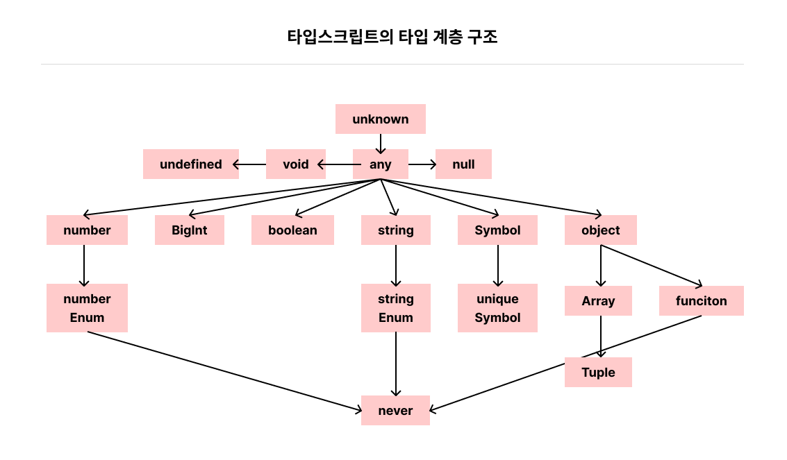

# 타입스크립트만의 독자적 타입 시스템

타입스크립트는 자바스크립트의 자료형에서 제시하지 않은 독자적인 타입 시스템을 가지고 있다.

자바스크립트의 슈퍼셋으로 정적 타이핑을 할 수 있는 타입스크립트가 등장하면서 비로소 타입스크립트의 타입 시스템이 구축되었다.<br /> 모든 타입 시스템은 타입스크립트에만 존재하는 키워드지만,<br /> 그 개념은 자바스크립트에 기인한 타입 시스템이라는 걸 인지하고 타입을 살펴봐야 한다.



<br />
<br />

## 1) any 타입

any 타입은 모든 값을 오류 없이 받을 수 있다. 자바스크립트에서의 기본 사용 방식과 같으므로 타입을 명시하지 않은 것과 동일한 효과를 나타낸다.

타입스크립트는 동적 타이핑 특징을 가진 자바스크립트에 정적 타이핑을 적용하는 것이 주된 목적이지만 any타입은 이러한 목적을 무시할 수 있다.

### tsconfig.json 파일에서 any에 대한 경고를 설정할 수 있다!

tsconfig.json 파일에서 **noImplicitAny** 옵션을 활성화하면 타입이 명시되지 않은 변수의 암묵적인 any 타입에 대한 경고를 발생시킬 수 있다.

### any 타입을 어쩔 수 없이 사용해야 할 때를 알아보자!

**(1) 개발 단계에서 임시로 값을 지정해야 할 때**

추후 값이 변경될 가능성이 있거나 아직 세부 항목에 대한 타입이 확정되지 않은 경우, any로 지정해 타입을 세세하게 명시하는 데 소요되는 시간을 절약할 수 있다.

**(2) 어떤 값을 받아올지 또는 넘겨줄지 정할 수 없을 때**

API 요청 및 응답 처리, 콜백 함수 전달, 타입이 잘 정제되지 않아 파악이 힘든 외부 라이브러리 등을 사용할 때 어떤 인자를 주고받을지 특정하기 힘들 때가 있다.

이처럼 주고받을 값이 명확하지 않을 때 any타입을 선언해야 할 수 있다.

```ts
type ModalParams = {
  show: boolean;
  // ...
  action?: any;
};
```

- action 속성은 모달 창을 그릴 때 실행될 함수이다.
- 다양한 범주의 액션에 따라 인자의 개수나 타입을 일일이 명시하기 힘들 수 있다.

> 이때 any 타입을 사용해 다양한 액션 함수를 전달할 수 있다.

**(3) 값을 예측할 수 없을 때 암묵적으로 사용**

브라우저의 `Fetch API`처럼 다양한 값을 반환하는 API가 있다.

`Fetch API` 일부 메서드는 요청 이후 응답을 특정 포맷으로 파싱하는데 이때 반환 타입이 any로 매핑되어 있다.

```ts
async function load() {
  const response = await fetch("https://api.com");
  const result = await response.json();

  return result;
}
```

> response.json()의 리턴 타입은 Promise<any>로 정의되어 있다.

**그럼에도 되도록이면 any타입은 지양하는 것이 좋다. 타입 검사를 무색하게 만들고 잠재적으로 위험한 상황을 초래할 수 있다.**

<br />
<br />

## 2) unknown 타입

unknown 타입은 모든 타입의 값이 할당될 수 있는 타입으로 타입스크립트 3.0이 릴리즈 될 때 추가되었다.

### any와의 차이점을 알아보자!

| 비교사항                            | any | unknown                |
| ----------------------------------- | --- | ---------------------- |
| 어떤 타입이든 해당 타입에 할당 가능 | O   | O                      |
| 해당 타입을 다른 타입으로 할당 가능 | O   | X (any 타입 외 불가능) |

```ts
let unknownValue: unknown;

unknownValue = "100"; // ✅ 함수, 숫자, 문자열 다 할당 가능
unknownValue = 100; // ✅

let a: any = unknownValue; // ✅ any 타입으로 선언한 변수를 제외한 다른 변수 모두 할당 불가
let b: string = unknownValue; // ❌
```

### any타입과 비슷한데 왜 unknown 타입이 추가되었을까?

```ts
const aFunction: unknown = () => console.log("a");
aFunction(); // ❌ 'aFunction' is of type 'unknown'.
```

위의 예시처럼 함수를 unknown타입 변수에 할당할 때는 컴파일러가 경고를 주지 않는다.<br />
실행하면 에러가 발생하는데 함수뿐만 아니라 객체 속성 접근, <br />
클래스 생성자 호출을 통한 인스턴스 생성 등 객체 내부에 접근하는 모든 시도에서 에러가 발생한다.

### 왜 호출 시 문제가 생길까?

unknown 타입으로 할당된 변수는 어떤 값이든 올 수 있음을 의미하는 동시에 개발자에게 엄격한 타입 검사를 강제하는 의도를 담고 있다. any 타입으로 사용할 경우 런타임에 예상치 못한 버그가 발생할 가능성이 높아지는데 unknown 타입은 이런 상황을 보완한다.

### any보다 어떤 점이 더 좋을까?

- any타입과 유사하지만 타입 검사를 강제한다.
- 타입이 식별된 후에 사용할 수 있어 더 안전하다.
- 데이터 구조를 파악하기 힘들 때는 unknown 타입으로 대체해서 사용하는 방법이 권장된다.

> 다만 어떤 값을 받을 지 모르는 상황에서 unknown을 사용하면 가공할 때 타입 캐스팅을 모두 해야 하는 상황이 생길 수 있다. (자바스크립트에서 타입스크립트로 변환 시도 동일)

### 또, 어떨 때 unknown 타입을 활용할 수 있을까?

```ts
const env = process.env as unknown as ProcessEnv;
```

위처럼 강제 타입 캐스팅을 통해 타입을 전환할 때 사용한다.

혹은, 타입스크립트 4.4부터 try-catch 에러의 타입이 any에서 unknown으로 변경되서 에러 핸들링을 할 때도 unknown을 사용할 수 있다.

다만 `as unknown as Type` 같이 강제 타입 캐스팅을 하기도 하는데 any와 다를게 없어 지양해야 한다.

<br />
<br />

## 3) void 타입

함수에 전달되는 매개변수의 타입과 반환하는 타입을 지정해야 하는데 타입스크립트에서는 함수가 어떤 값을 반환하지 않는 경우는 void로 지정하여 사용한다.

- void 타입은 undefined가 아니다.
- 함수에 국한된 타입은 아니다.
- 변수에도 할당할 수 있지만 함수가 아닌 값에 대해선 대부분 무의미하다.
- void로 할당된 변수는 undefined 또는 null값만 할당할 수 있다.
- 명시적인 의미를 부여하는 관점에서 undefined와 null 타입 키워드를 직접 사용해 타입을 지정하는 것이 더 바람직하다.
- 일반적으로 함수 자체를 다른 함수 인자로 전달하는 경우가 아니면 void 타입은 잘 명시하지 않는다.(알아서 컴파일러가 추론하기 때문)

<br />
<br />

## 4) never 타입

일반적으로 함수 관련해서 많이 사용되는 타입으로, 값을 반환할 수 없는 타입을 말한다. 여기서 값을 반환하지 않는 것과 반환할 수 없는 것을 명확히 구분해야 한다.

### 자바스크립트에서 값을 반환할 수 없는 예시를 알아보자!

**(1) 에러를 던지는 경우**

자바스크립트는 런타임에 의도적으로 에러를 발생시키고 캐치할 수 있다.

throw 키워드를 사용해 에러를 발생시킬 때, 이는 값을 반환하는 것으로 간주하지 않는다. 특정 함수가 실행 중 마지막에 에러를 던지는 작업을 수행한다면 해당 함수의 반환 타입은 never이다.

```ts
function generateError(res: Response): never {
  throw new Error(res.getMessage());
}
```

**(2) 무한히 함수가 실행되는 경우**

함수 내에서 무한 루프를 실행하는 경우 함수가 종료되지 않음을 의미하기 때문에 값을 반환하지 못한다.

### never에 다른 특징을 알아보자!

never 타입은 모든 타입의 하위 타입으로 never 자신을 제외한 어떤 타입도 never 타입에 할당될 수 없다.<br />
조건부 타입을 결정할 때 특정 조건을 만족하지 않는 경우, 엄격한 타입 검사 목적으로 명시적으로 사용하기도 한다.

<br />
<br />

## 5) Array 타입

배열 타입을 나타내는 Array 키워드는 자바스크립트에서도 `Object.prototype.toString.call(...)` 연산자를 사용해 확인할 수 있다.

`Object.prototype.toString.call(...)`은 객체 타입을 알아내는 데 사용하는 함수로, typeof의 경우 객체 타입을 단순히 object 타입으로 알려주지만 `Object.prototype.toString.call(...)` 함수는 객체의 인스턴스까지 알려준다.

```ts
const arr = [];
console.log(Object.prototype.toString.call(arr)); // [object Array]
```

### 왜 타입스크립트에서 배열을 다뤄야할까?

1. 자바스크립트에서는 배열은 객체에 속하는 타입이다. (배열을 단독 배열이라는 자료형에 국한하지 않는다.)
2. 타입스크립트에서 Array 타입을 사용하기 위해 특수한 문법을 함께 다뤄야 한다.

### 배열보다 더 좁은 범위인 튜플(Tuple)도 있다!

배열은 Array 키워드와 대괄호([])를 사용해 직접 타입을 명시할 수 있는데, 이때 타입은 배열보다 더 좁은 범위인 튜플이다.

### 다른 언어에서는 배열을 어떻게 다룰까?

타입스크립트 뿐만 아니라 자바, C++과 같은 정적 언어에서는 배열의 원소로 하나의 타입만 사용하도록 명시한다.

배열을 선언할 때 크기까지 제한하기도 하는데 타입스크립트에서는 배열의 크기까지 제한하지 않지만<br />
정적 특성을 살려 명시적인 타입을 선언하여 **해당 타입의 원소를 관리하는 것을 강제**한다.

```ts
const arr: number[] = [1, 2, 3]; // 숫자 원소만 허용
const arr: Array<number> = [1, 2, 3]; // 위와 동일한 타입
```

- 자료형 + 대괄호([]) 형식으로 배열 타입 선언
- 제네릭 방식으로 배열 타입 선언

> 두 방식의 차이점은 선언 형식 외에는 없다.

```ts
const arr1: Array<number | string> = [1, "1"];
const arr2: number[] | string[] = [1, "1"];
const arr3: (number | string)[] = [1, "1"];
```

여러 타입을 모두 관리해야 하는 배열을 선언하려면 유니언 타입을 사용하면 된다.

### 배열 기능에 길이 제한을 추가하려면?

튜플이라는 배열 하위 타입으로 길이 제한을 추가하면 된다. 대괄호 안에 타입 시스템을 기술하고, 대괄호 안에 선언하는 타입 개수가 튜플이 가질 수 있는 원소의 개수이다.

즉, 튜플은 배열의 특정 인덱스에 정해진 타입을 선언하는 것과 같다. 튜플을 이용해 사전에 허용하지 않은 타입이 서로 섞이는 것을 방지해 타입 안정성을 제공한다.

```ts
let tuple: [number] = [1]; // ✅
tuple = [1, 2]; // ❌
tuple = [1, "1"]; // ❌

let tuple: [number, string, boolean] = [1, "1", true]; // ✅
```

> 튜플의 경우 컨벤션을 잘 지키고 각 배열 원소의 명확한 의미와 쓰임을 보장할 때 더욱 안전하게 쓸 수 있는 타입이다.

### 리액트 훅을 예시로 튜플 사용 예시를 살펴보자!

리액트 16.8 버전부터 도입된 훅이라는 요소 중 useState는 튜플 타입을 반환한다.

1. 첫 번째 원소는 훅으로 부터 생성 및 관리되는 상태 값을 의미한다.
2. 두 번째 원소는 해당 상태를 조작할 수 있는 세터를 의미한다.

> useState API는 배열 원소의 자리마다 명확한 의미를 부여하기 때문에 컴포넌트에서 사용하지 않은 값에 접근하는 오류를 방지할 수 있다. 또 구조 분해 할당을 사용해 사용자가 자유롭게 이름을 정의할 수 있다.

```ts
import { useState } from "react";

const [value, setValue] = useState(false);
```

### 튜플과 배열의 성질을 혼합해 사용할 수 있다!

스프레드 연산자(...)를 사용해 특정 인덱스에서 요소를 명확한 타입으로 선언할 수 있다.<br />
이후 나머지 인덱스에서는 배열처럼 동일한 자료형의 원소를 개수 제한 없이 받도록 할 수 있다.

```ts
const example: [number, string, ...number[]] = [1, "1", 2, 3, 4];
```

### 옵셔널 프로퍼티(선택적 속성)를 명시하고 싶을 때는?

물음표(?) 기호와 함께 해당 속성을 선언할 수 있다. 해당 원소는 옵셔널하기 때문에 해당 인덱스에 필수적으로 자리 잡고 있지 않음을 의미한다.

> **옵셔널(optional)?** <br />특정 속성 또는 매개변수가 값이 있을 수도 없을 수도 있는 것을 의미한다. 선택적 속성은 타입스크립트에서 좀 더 유연한 데이터 모델링과 사용자 정의 타입을 지원하기 위한 개념이다.

```ts
const tuple1: [number, number?] = [1, 2];
const tuple2: [number, number?] = [1];
```

<br />
<br />

## 6) enum 타입

enum 타입은 열거형으로 부르는데 일종의 구조체를 만드는 타입 시스템이다.

- enum 사용으로 열거형을 정의할 수 있는데 열거형은 각각의 멤버를 가지고 있다.
- 타입스크립트는 명명한 각 멤버의 값을 스스로 추론한다.
- 기본적인 추론 방식은 숫자 0부터 1씩 늘려가며 값을 할당하는 것이다.

```ts
enum Names {
  kim, // 0
  lee, // 1
  park, // 2
  chu, // 3
  oh, // 4
}

// 각 멤버 접근 방식은 객체 속성 접근 방식과 동일
Names.chu; // 3
Names["chu"]; // 3

// 역방향 접근도 가능하다
Name[3]; // "chu"
```

### 각 멤버에 명시적 값 할당도 가능하다!

명시적 값을 할당할 수도 있지만 일부 멤버에 값을 직접 할당하지 않아도<br /> 타입스크립트는 누락된 멤버를 이전 멤버 값의 숫자 기준으로 1씩 늘려가며 자동으로 할당한다.

```ts
enum Names {
  kim = "kim",
  lee = "lee",
  park = 100,
  chu, // 101
  oh, // 102
}
```

### 주로, enum은 언제 쓰일까?

문자열 상수를 생성하는 데 사용해 응집력있는 집합 구조체를 만들 수 있다.
이를 통해 사용자 입장에서도 간편하게 활용하고, 열거형 그 자체로 변수 타입으로도 지정할 수 있다.

이때, 열거형을 타입으로 가지는 변수는 **해당 열거형이 가지는 모든 멤버를 값으로 받을 수 있다.**(코드의 가독성을 높여주는 효과!)

### 아래 예시에서 enum을 사용해 얻을 수 있는 효과를 문자열 타입 지정과 비교해보자!

```ts
enum StatusType {
  HOLD = "HOLD",
  READY = "READY",
  DELIVERING = "DELIVERING",
  DELIVERED = "DELIVERED",
}

const checkItemStatus = (itemStatus: StatusType) => {
  switch (itemStatus) {
    case StatusType.HOLD:
    case StatusType.READY:
    case StatusType.DELIVERING:
      return false;

    case StatusType.DELIVERED:
    default:
      return true;
  }
};
```

1. 타입 안정성: StatusType에 명시되지 않은 다른 문자열은 인자로 받을 수 없다.
2. 명확한 의미 전달과 높은 응집력 : StatusType이 다루는 값이 명확하고, 상태에 대한 값을 모아있는 것이라 응집력이 높다.
3. 가독성: 응집도가 높기 때문에 말하는 바가 명확하다. 열거형 멤버를 통해 어떤 상태를 나타내는 지 쉽게 이해 가능하다.

### 주의할 점은 없을까?

숫자로만 이루어져 있거나 타입스크립트가 자동으로 추론한 열거형은 안전하지 않은 결과를 낳을 수 있다.또, 역방향으로 접근하더라도 타입스크립트는 이를 막지 않는다.

### 그럴 때 const enum을 사용한다!

역방향 접근을 허용하지 않아 자바스크립트에서의 객체에 접근하는 것과 유사한 동작을 보장하지만<br /> 숫자 상수로 관리되는 열거형은 선언한 값 이외의 값을 할당하거나 접근할 때 이를 방지하지 못한다.

반면 문자열 상수 방식으로 선언한 열거형은 미리 선언하지 않은 멤버로 접근을 방지할 수 있어<br /> 문자열 상수 방식으로 열거형을 사용하는 것이 숫자 상수 방식보다 안전한다.

의도하지 않은 값의 할당이나 접근을 방지하는 데 도움이 된다.

```ts
const enum NUMBER {
  ONE = 1,
  TWO = 2,
}

const num: NUMBER = 100; // Error! (확인 필요)

const enum STRING {
  ONE = "1",
  TWO = "2",
}

const strNum: STRING = "3"; // Error!
```

> 현재 코드에서는 `const num: NUMBER = 100;` 해당 부분도 동일하게 에러가 난다. 왜 에러가 나는 지 깊이 파보자!!

### 이외에도 열거형의 가장 큰 문제가 있다!

타입스크립트 코드가 자바스크립트 코드로 변환될 때 `즉시 실행 함수(IIFE) `형식으로 변환된다.

```ts
enum Direction {
  Up,
  Down,
  Left,
}
```

```js
"use strict";
var Direction;
(function (Direction) {
  Direction[(Direction["Up"] = 0)] = "Up";
  Direction[(Direction["Down"] = 1)] = "Down";
  Direction[(Direction["Left"] = 2)] = "Left";
})(Direction || (Direction = {}));
```

일부 번들러에서 트리쉐이킹 과정 중 즉시 실행 함수로 변환된 값을 사용하지 않는 코드로 인식하지 못하는 경우가 발생할 수 있어 불필요한 코드의 크기가 증가하는 결과가 생길 수 있다.

이런 문제를 해결하기 위해 `const enum` 또는 `as const assertion`을 사용해 유니온 타입으로 열거형과 동일한 효과를 얻는 방법이 있다.

### as const assertion으로 활용해보자!

```ts
const Color = {
  RED: "red",
  BLUE: "blue",
} as const;

const color: (typeof Color)[keyof typeof Color] = Color.RED;

console.log(color);
```

```js
"use strict";
const Color = {
  RED: "red",
  BLUE: "blue",
};
const color = Color.RED;
console.log(color);
```

Color는 단순한 객체로 변환되어 ✅ 트리 쉐이킹이 가능하다.
