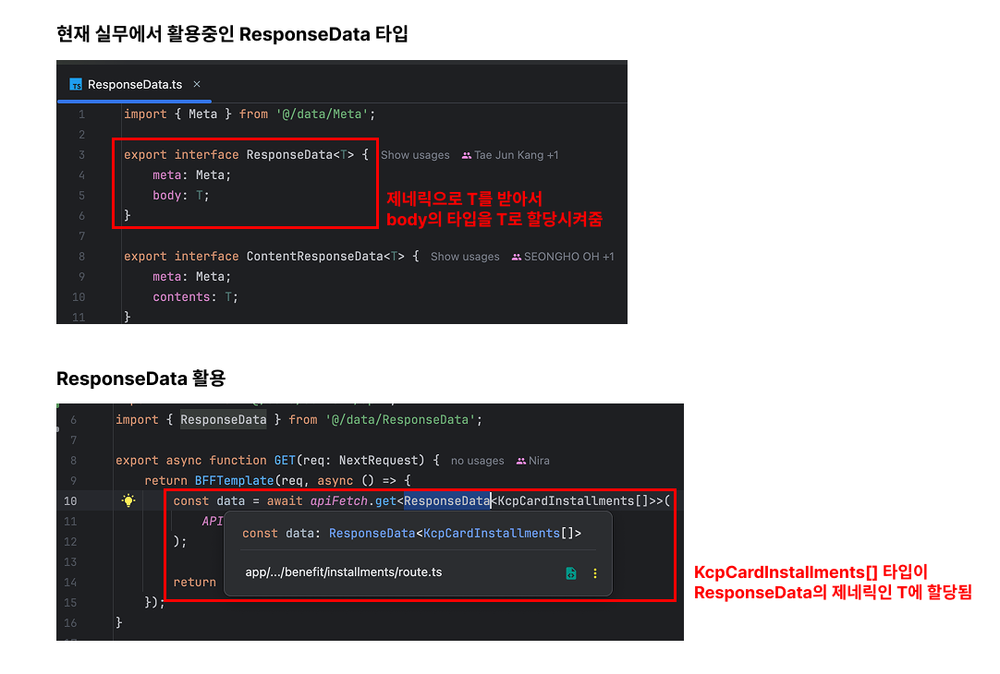

### 함수의 제네릭
---
어떤 함수의 매개변수나 반환값에 다양한 타입을 넣고 싶을 때 제네릭을 사용할 수 있음.

```ts
interface NoAnyClub<T> {
    name: T;
    url: string;
}

interface Figci<T> {
    name: T;
    contributor: string[];
}

function getRepoName<T>(repoName: NoAnyClub<T> | Figci<T>): T {
    return repoName.name;
}
```

<br />

이처럼 `T`자리에 넣는 타입에 따라서 적절하게 사용될 수 있음.

<br />

### 호출 시그니처의 제네릭
---
`호출 시그니처`는 타입스크립트의 함수 타입 문법으로, 함수의 매개변수와 반환타입을 미리 선언 하는것을 말함. <br />
여기서도 제네릭을 사용할 수 있는데
```ts
interface Meta {}

interface Props {}

interface BodyType<T> {
    contents: T[];
}

interface FetchResponseType<T> {
    meta: Meta;
    body: BodyType<T>
}

type fetcher = <T>(props: Props) => Promise<FetchResponseType<T>>
```
호출 시그니처를 사용할 때 제네릭 타입을 어디 위치시키는지에 따라서 **타입의 범위**와 **제네릭 타입을 언제 구체타입으로 한정할지**를 결정할 수 있음.

```ts
// 우아한형제들 활용 예시
interface useSelectPaginationProps<T> {
  categoryAtom: RecoilState<T>;
  filterAtom: RecoilState<string[]>;
  sortAtom: RecoilState<SortType>;
  fetcherFunc: (props: CommonListRequest) => Promise<DefaultResponse<ContentListResponse<T>>>
}
```
여기서는 `useSelectPaginationProps`를 사용할 때 타입을 명시함으로서 제네릭 타입을 구체 타입으로 한정함. <br />

또 다른 예시를 봐보자
```ts
export type useRequestHookType = <RequestData = void, ResponseData = void>(
  baseURL?: string | Headers,
  defaultHeader?: Headers
) => [RequestStatus, Requester<RequestData, ResponseData>];
```
이 예시에서 `RequestData`와 `ResponseData`는 `제네릭`으로 선언되었기 때문에, `useRequestHookType`타입의 함수를 **실제 호출할 때 제네릭 타입을 구체 타입으로 한정함**.

<br />

### 제네릭 클래스
---
`제네릭 클래스`는 외부에서 입력된 타입을 클래스 내부에 적용할 수 있는 클래스임.
```ts
class LocalDB<T> {
    // ...

    async put(table: string, row: T): Promise<T> {
        return new Promise<T>((resolve, reject) => {
            // T타입 데이터 저장
        });
    }

    async get(table: string, key: any): Promise<T> {
        return new Promise<T>((resolve, reject) => {
            // T타입 데이터를 DB에서 가져옴
        });
    };

    // ...
}
```
이처럼 클래스 이름 뒤에 타입 매개변수 `<T>`를 선언해줌. <br />
제네릭 클래스를 사용하면 클래스 전체에 걸쳐 타입 매개변수가 적용됨.
만약, 특정 메서드만 제네릭을 적용하려면 해당 메서드를 제네릭 메서드로 선언하면 됨.

<br />

### 제한된 제네릭
`제한된 제네릭`이란 `타입 매개변수`에 대한 **제약 조건**을 설정하는 기능을 말함. <br />
만약, 타입 매개변수 <T>를 string타입으로 제약하려면 타입 매개변수는 특정타입을 `상속(extends)` 해야 함.
```ts
interface Foo<T extends string> {
  bar: T;
}

// T = 바운드 타입 매개변수
// string = 상한 한계
```

이처럼 타입 매개변수가 특정 타입으로 묶였을 때(`bind`) 해당 타입 매개변수를 `바운드 타입 매개변수` 라고 부름. 그리고 타입 매개변수를 묶는 타입 매개변수를 `상한 한계`라고 함. <br />

이때 상속받을 수 있는 타입은 `기본 타입` 뿐만이 아니라, 상황에 따라 `인터페이스`나 `클래스`, `유니온 타입`도 상속 해서 선언할 수 있음.
```ts
interface Bar {
  name: string;
}

interface Baz {
  name: string;
  age: number
}

async function Foo<T extends Bar | Baz>(params: T): Promise<string> {
  return params.name;
}

const obj: Bar = {
    name: 'seongho',
};

const obj2: Baz = {
    name: 'seongho2',
    age: 123,
}

const obj3 = {
    loc: 'gp',
}

Foo(obj); // ✅
Foo(obj2); // ✅
Foo(obj3); // ❌
```

```ts
// 배민 예시
function useSelectPagination<T extends CardListContent | CommonProductResponse>({
  filterAtom,
  sortAtom,
  fetcherFunc
}: useSelectPaginationProps<T>): {
  intersectionRef: RefObject<HTMLDivElement>;
  data: T[];
  categoryId: number;
  isLoading: boolean;
  isEmpty: boolean;
} {
  // ...
}

// 사용하는 쪽 코드
const { intersectionRef, data, isLoading, isEmpty } =
  useSelectPagination<CardListContent>({
    filterAtom: replyCardFilterAtom,
    sortAtom: replyCardSortAtom,
    fetcherFunc: fetchReplyCardListByThemeGroup,
    categoryAtom: replyCardCategoryIdAtom,
  });
```
<br />

### 확장된 제네릭
---
제네릭은 여러 타입을 상속받을 수 있으며, 타입 매개변수를 여러개 둘 수도 있음.
```ts
<T extends string | number>
```
이처럼 유니온 타입으로 T가 여러개 타입을 받게 할 수 있지만, 타입 매개변수가 여러개일 경우에는 처리할 수 없음.
이럴 때는 매개변수를 하나 더 추가하여 선언함. <br />
```ts
// 우아한형제들 예시
interface AxiosError extends Error {
    response: Record<string, any>;

}

enum ResponseStatus {
    SUCCESS = 'SUCCESS',
    FAILURE = 'FAILURE',
    CLIENT_ERROR = 'CLIENT_ERROR',
    SERVER_ERROR = 'SERVER_ERROR',
}

export class APIResponse<Ok, Err = string> {
  private readonly data: Ok | Err | null;
  private readonly status: ResponseStatus;
  private readonly statusCode: number| null;

  constructor(
    data: Ok | Err | null,
    statusCode: number | null,
    status: ResponseStatus
  ) {
    this.data = data;
    this.statusCode = statusCode;
    this.status = status;
  }

  public static Success<T, E = string>(data: T): APIResponse<T, E> {
    return new this<T, E>(data, 200, ResponseStatus.SUCCESS);
  }

  public static ERROR<T, E = string>(error: AxiosError): APIResponse<T, E> {
    if (!error.response) {
        return new this<T, E>(null, null, ResponseStatus.CLIENT_ERROR);
    }

    if (!error.response.data?.result) {
        return new this<T, E>(null, error.response?.status, ResponseStatus.SERVER_ERROR);
    }

    return new this<T, E>(error.response.data.result, error.response.status, ResponseStatus.FAILURE);
  }
}
```
해당 예시에서 `Ok`와 `Err`이라는 제네릭을 두개 받아서 사용하고 있음.

<br />

### 제네릭 예시
제네릭의 장점은 코드를 효율적으로 재사용이 가능하다는 점임. <br />
그렇다면 가장 많이 활용되는 경우는 언제일까? 바로 API응답 값의 타입을 지정할 때 임.
```ts
interface Meta {}

interface Contents {}

interface Video {}

interface ResponseData<T> {
  meta: Meta;
  body: T;
}

const getContentsList = async (): Promise<ResponseData<Contents[]>> {
  // fetch something and return response..
}

const getContentsVideoList = async <T>(): Promise<ResponseData<Video[]>> { // ResponseData 재사용
  // fetch something and return response..
}

const { body } = await getContentsList();
// body는 Contents[] 타입

const { body } = await getVideoList();
// body는 Video[] 타입
```
요로코롬 `ResponseData를` 다양한 API응답에 효율적으로 재사용이 가능함.

<br />



-> 실제 회사에서 활용중인 `제네릭` 활용 예시

<br />

이런식으로 제네릭을 필요한 곳에 사용하면 가독성과 효율성이 증가하지만, ***불필요한 곳에 사용하게되면 코드의 복잡성만 증가시킴***

<br />

### 제네릭을 굳이 사용하지 않아도 되는 타입
---
제네릭이 굳이 필요하지 않은데도 사용하면 코드의 길이만 늘어나고, 가독성을 해침.
```ts
type Generic<T> = T;
type Status = 'TODO' | 'IN PROGRESS' | 'DONE';

interface Issue {
  getStatus(): Generic<Status>;
}

// 위 코드는 그냥 아래와 같음.

interface Issue {
    getStatus(): Status;
}
```

<br />

추가적으로 제네릭에 `any`를 사용하면 제네릭의 장점과 `타입 추론` 및 `타입 검사`를 할수 있는 이점을 누릴 수 없음. <br />
한마디로 제네릭을 사용하는 의미가 없다는 것.

> [!WARNING]
> **가독성을 고려하지 않은 사용** <br />
> 제네릭을 과하게 사용하면 가독성을 해치기 때문에 코드를 읽고 타입을 이해하기가 어려워짐. <br />
> 그러니 부득이한 상황을 제외하고 제네릭은 의미 단위로 분할해서 사용하자.
> ```ts
> // 과도한 제네릭 사용 예시
> ReturnType<Record<OrderType, Partial<Record<CommonOrderStatus | CommonReturnStatus, Partial<Record<OrderRoleType, string[]>>>>>>;
> ```
> ;;;; 보기만 해도 어지럽고 보기 싫어진다;;
