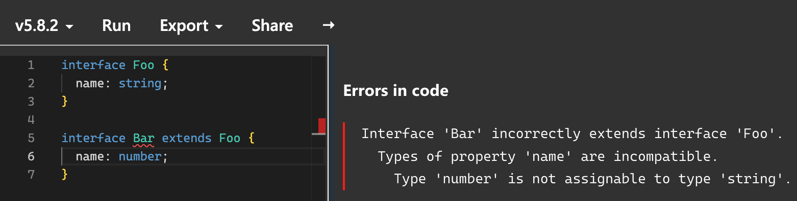
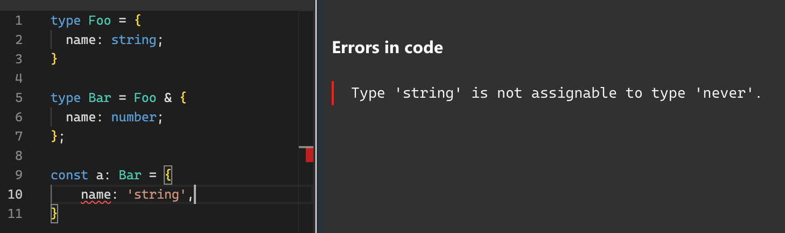

타입 확장은 기존 타입을 사용해서 새로운 타입을 정의하는것을 말함.<br />
기본적으로 ts는 `extends`, `교차 타입`, `유니온 타입`을 사용해서 타입을 확장함.

<br />

### 타입 확장의 장점
---
`타입 확장`의 가장 큰 장점은 코드 중복을 줄일 수 있다는 점임. ts를 사용하다보면 필연적으로 중복코드가 생길 수 밖에 없는데 <br />
이때 타입 확장을 통해서 불필요한 중복을 줄일 수 있음.
```ts
// interface 버전
interface BaseMenuItem {
  itemName: string | null;
  itemImageUrl: string | null;
}

interface BaseCartItem extends BaseMenuItem {
  count: number;
}

// 타입 별칭(type) 버전
type BaseMenuItem = {
  itemName: string | null;
  itemImageUrl: string | null;
};

type BaseCartItem = {
  count: number;
} & BaseMenuItem;
```
-> 이처럼 `확장`을 사용하면 불필요한 중복을 줄일 수 있음.

`타입 확장`은 이름처럼 **확장성**이란 장점을 가지고 있음. 관련된 요구사항이 늘어날 때마다 필요한 부분만 추가한 뒤 확장을 시키면 손쉽게 타입을 만들 수 있음.
```ts
interface BaseMenuItem {
  itemName: string | null;
  itemImageUrl: string | null;
}

interface BaseCartItem extends BaseMenuItem {
  count: number;
}

interface EventCartItem extends BaseCartItem {
  orderable: boolean;
}
```
또한 기존 `BaseMenuItem`에 변경사항이 생겨도 `BaseCartItem`와 `EventCartItem`은 수정하지 않고, `BaseMenuItem`만 수정하면 되기 때문에 효율적임.

<br />

### 유니온 타입
---
유니온 타입은 **2개 이상의 타입을 조합하여 사용하는 방법**임.
이를 집합의 관점으로 보면 유니온 타입은 `합집합`으로 해석 가능함. <br />
`type MyUnion = A | B;` <br />

**근데 여기서 주의해야 할 점은 앞에서도 말했듯이, `유니온 타입`으로 선언된 값은 _유니온 타입에 포함된 모든 타입이 공통으로 갖고있는 속성에만 접근이 가능함._**
```ts
interface Person {
    name: string;
    age: number;
}

interface Dog {
    name: string;
    tail: boolean;
}

type Animal = Person | Dog;

function foo(animal: Animal) {
    animal.tail // ❌ Error!
}
```

> [!IMPORTANT]
> 타입스크립트의 타입을 속성의 집합이 아니라, 값의 집합이라고 생각해야 유니온 타입이 합집합 이라는 개념을 이해할 수 있음.

즉, ***`Animal`은 `Person`또는 `Dog`타입에 해당할 뿐이지, `Person`이면서 `Dog`인것은 아니라는 것*** 인데 이해가 잘 가질 않음. <br />

조금 더 직관적으로 해석 해보자.
```ts
// 최최종
interface A {
  name: string;
  age: number;
}

interface B {
  age: string;
  loc: string;
}

type AB = A | B;
```
여기서 `AB`는
`{
    name: string;
    age: number;
}`
또는
`{
  age: number;
  loc: string;
}`
라는 것이지, `A`와 `B`가 합쳐진
***`{
  name: string;
  age: number;
  loc: string;
}`이 아니라는 것이다!!***

<br />

### 교차 타입
`교차 타입`도 기존 타입을 합쳐서 필요한 모든 기능을 가진 하나의 타입을 만드는 것임.
```ts
type DuckA = {
  '뒤뚱뒤뚱': true;
  '꽥꽥': true;
};

type DuckB = {
  '꽥꽥': true;
  '포동포동': true;
}

type DuckC = DuckA & DuckB;
// {
//   '뒤뚱뒤뚱': true;
//   '꽥꽥': true;
//   '포동포동': true;
// }
```
뭔가 이상하다????????????????????? <br/>
교차 타입은 `교집합`이라고 했는데, 결과만 보면 `DuckC`는 `DuckA`와 `DuckB`의 타입을 합친 `합집합`으로 보임.

### 왜이러는 걸까? 🤔

앞서 타입 확장은 ***`기존 타입을 사용해서 새로운 타입을 정의하는것`*** 이라고 했음. <br />
즉, `type DuckC = DuckA & DuckB`는 `DuckA`과 `DuckB`를 사용해서 새로운 `교집합 타입인 DuckC`라는 타입을 만드는 것이라고 해석할 수 있음. <br />
그렇다면 `교집합 타입인 DuckC`는 말 그대로 **'교집합'** 을 만족하는 새로 만들어진 타입이니까 `DuckA`와 `DuckB`를 만족하는 타입이라고 볼 수 있음. <br />
여기서 ts의 **`구조적 타이핑`** 특성을 활용한다면 `DuckA`와 `DuckB`를 모두 만족하는 `교집합 타입`이 되려면
`DuckA`와 `DuckB`의 특성을 모두 가질 수 밖에 없는것임. <br />

***따라서 `DuckC`가 위 예시처럼 합쳐진 타입처럼 되는 것.***

미쵸따 미쵸써 이제 조금 감이 잡힌다

다른 예시를 살펴보자
```ts
interface DeliveryTip {
  tip: string;
}

interface StartRating {
  rate: number;
}

type Filter = DeliveryTip & StartRating;

const filter: Filter = {
  tip: '배달 팁',
  rate: 4,
};
```
이 예시도 동일함. <br />
`DeliveryTip`과 `StartRating`은 공통된 특성이 없는데도, `Filter`의 타입은 공집합(`never`타입)이 아닌 두 타입의 프로퍼티를 모두 포함한 타입이 됨.<br />
`교차 타입`을 사용할 때 서로 호환되지 않는 경우도 있음.
```ts
type A = string | number;
type B = boolean | number;

type C = A & B; // number;
```
여기서 `C`는 두 타입을 모두 만족하는 경우에만 유지가 되기 때문에, `number`가 됨.

<br />

### extends와 교차 타입
---
`extends` 키워드를 사용해서 교차 타입을 작성할 수도 있음.
```ts
interface Foo {
  name: string;
  age: number;
}

interface Bar extends Foo {
  location: string;
}
```
`Bar`는 `Foo`를 확장함으로써 `Foo`의 속성을 모두 포함하고 있음. 이는 곧 `Bar`는 `Foo`의 속성을 모두 포함하는 `상위 집합`이 되고, `Foo`는 `Bar`의 `부분집합`이 되는 것. <br />

이를 교차타입의 관점에서 작성해본다면?
```ts
type Foo = {
  name: string;
  age: number;
}

type Bar = {
  location: string;
} & Foo;
```
이렇게 됨.
> [!NOTE]
> `유니온`과 `교차 타입`을 사용해서 만드는 새로운 타입은 `타입 별칭(type)`으로만 선언이 가능함.(`interface`로는 불가)

### `교차 타입`과 `extends`는 완벽하게 일치하지 않음.
아래 예시를 살펴보자
```ts
interface Foo {
  name: string;
}

interface Bar extends Foo { // Error!
  name: number;
}
```
`extends`를 할때 동일한 속성을 다른 타입으로 선언하려고 하면, 타입이 호환되지 않는다는 에러가 발생함.


그러나 `교차 타입`은 에러가 발생하지 않음.
```ts
type Foo = {
  name: string;
}

type Bar = {
  name: number;
} & Foo;

// Bar의 name 타입은 never.
```
`교차 타입`으로 동일한 속성을 다른 타입으로 선언하면 에러는 발생하지 않지만, 같은 속성에 대해 서로 호환되지 않는 타입이 선언되어서 `never`타입이 되버림.


<br />

### 배민에서는 타입 확장을 어떻게 사용하는지 맛보기
---

<br />

위 이미지는 배민 서비스 메뉴 목록임.
이를 바탕으로 `Menu`라는 인터페이스를 표현 해보자
```tsx
interface Menu {
  name: string;
  image: string;
}

function MainMenu() {
  const menuList: Menu[] = [
    { name: '홈', image: '홈.png' },
    { name: '치킨', image: '치킨.png' },
    ...
    { name: '도시락', image: '도시락.png' },
  ];

  return (
    <ul>
      {
        menuList.map((menu) => (
          <li>
            
            <span>{menu.name}</span>
          </li>
        ));
      }
    </ul>
  );
}
```

이때, 아래와 같은 2가지 요구사항이 추가되었다고 가정해보자
- ***특정 메뉴를 길게 누르면 gif파일이 재생되어야 함***
- ***특정 메뉴는 이미지 대신 별도의 텍스트만 노출되어야 함***

이러한 요구사항을 만족하는 타입을 작성하는 방법은 2가지로 생각해볼 수 있음.
```ts
// 1. 타입 내에서 속성 추가
interface Menu {
  name: string;
  image: string;
  gif?: string;
  text?: string;
}

// 2. 기존 타입을 확장하는 방법
interface Menu {
  name: string;
  image: string;
}

interface SpecialMenu extends Menu {
  gif: string;
}

interface PackageMenu extends Menu {
  text: string;
}
```

<br />
`방법 1`과 `방법 2` 각각 적용해보자

```ts
// 서버에서 내려주는 데이터는 아래와 같다고 가정해보자

const menuList = [
  { name: '홈', image: '홈.png', },
  { name: '치킨', image: '치킨.png', },
];

const specialMenuList = [
  { name: '돈까스', image: '돈까스.png', gif: '돈까스.gif', },
  { name: '피자', image: '피자.png', gif: '피자.gif', },
];

const packageMenuList = [
  { name: '돈까스', image: '돈까스.png', text: '돈까스 또도가스', },
  { name: '피자', image: '피자.png', text: '피자는 고구마피자', },
];
```

#### 방법 1
```ts
interface Menu {
  name: string;
  image: string;
  gif?: string;
  text?: string;
}

menuList: Menu[];
specialMenuList: Menu[];
packageMenuList: Menu[];
```
이렇게 하나의 타입으로 모두 표현이 가능함. 그러나 아래와 같은 문제가 발생할 수 있음.
```ts
specialMenuList.map((menu) => menu.text);
// 실제로 런타임에서는 없는 값이기 때문에 undefined가 나옴
```

#### 방법 2
```ts
interface Menu {
  name: string;
  image: string;
}

interface SpecialMenu extends Menu {
  gif: string;
}

interface PackageMenu extends Menu {
  text: string;
}

menuList: Menu[];
specialMenuList: SpecialMenu[];
packageMenuList: PackageMenu[];
```
이렇게 작성하면 프로그램을 실행하지 않고도, `컴파일 타임`에 에러를 감지할 수 있음.
```ts
specialMenuList.map((menu) => menu.text); // ❌ Property 'text' does not exist on type 'SpecialMenu'.
```
<br />

따라서 결과적으로 **한 타입에 무분별하게 속성을 추가해서 사용하는 것 보다 타입을 확장해서 사용하는 것이 좋음.** <br />
타입을 확장해서 분리하면 아래와 같은 이점을 얻을 수 있음.
- ***적절한 네이밍을 통해서 의도를 명확하게 할 수 있음***
- ***코드 작성 단계에서 예기치 못한 버그를 예방할 수 있음***
