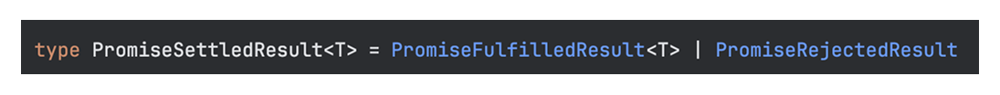

### 타입 가드에 따라 분기 처리하기
---
ts에서 타입 `좁히기(타입 가드)`는 변수 또는 표현식의 타입 범위를 더 작은 범위로 좁혀나가는 과정임.

이로 인해서 타입의 안정성을 높일 수 있음.

ts로 개발을 하다보면 여러 타입을 할당할 수 있는 `스코프`에서 특정 타입을 조건으로 만들어서 분기 처리하고 싶을 경우가 있음.

> [!TIP]
> **스코프(Scope)** <br />
> 변수가 함수등의 식별자가 유효한 범위를 나타냄. <br/>
> 즉, 변수와 함수를 선언하거나 사용할 수 있는 영역을 말함.

예를 들어서 어떤 함수가 `A | B`타입의 매개변수를 받고, 이를 구분해서 처리하고 싶다면 어떻게 해야 할까? <br />
`if문`을 사용해서 처리하면 될 것 같지만 `ts`는 컴파일 시 타입 정보가 모두 제거되기 때문에 타입을 사용해서 조건을 만들 수는 없음. 즉, 컴파일을 해도 사라지지 않는 방법을 사용해야 함.

***그렇게 하려면 ts가 해당 변수를 타입 A로 추론되게끔 하면서, 런타임에서도 유효한 방법이 필요한데, 이때 `타입 가드`를 사용하면 됨.***

타입 가드는 크게 두가지로 분류할 수 있음.
- 타입 가드
  - `js 연산자를 활용한 타입 가드`
  - `사용자 정의 타입 가드`

`js연산자를 활용한 타입 가드` <br />
: `typeof`, `instanceof`, `in`과 같은 연산자를 사용해서 특정 타입 값을 가질 수밖에 없는 상황을 유도하여 자연스럽게 타입을 좁히는 방식. <br />
<span></span>


`사용자 정의 타입 가드` <br />
: 사용자가 직접 어떤 타입으로 좁힐지 지정하는 방식.

<br />

### 원시타입을 추론할 때: `typeof` 연산자 활용하기
---
`typeof`연산자를 활용하면 원시 타입에 대해 추론이 가능함. 다만, typeof는 js타입 시스템만 대응이 가능함. <br />
또한 `null`과 `배열`등의 타입이 `object`로 판별되는 등, 복잡한 타입을 검증하기에는 한계가 있음. <br />
***따라서 `typeof`는 주로 하위에 명시된 원시 타입을 좁히는 용도로만 사용할 것을 권장.***
- `string`
- `number`
- `boolean`
- `undefined`
- `object`
- `function`
- `bigint`
- `symbol`

```ts
const Foo:(date: string | Date): string | Date = (date) => {
  if (typeof date === 'string') {
    date.toUpperCase(); // 여기서 date는 string타입으로 추론.
  }

  return date;
};
```

<br />

### 인스턴스화 된 객체 타입을 판별할 경우: `instanceof` 연산자 활용하기
---
```ts
interface DateRange {
    start: Date;
    end: Date;
}

interface Params {
    selectedDate?: Date | DateRange;
}

const DatePicker = ({selectedDate}: Params) {
    const [selected, setSelected] = useState(convertToRange(selectedDate));
};

const convertToRange: (selected: DateRange | Date) => DateRange = (selected) => {
    if (selected instanceof Date) {
        return { start: selected, end: selected };
    }

    return selected;
};
```
`typeof` 연산자를 주로 원시타입을 판별하는데, 사용한다면 `instanceof` 연산자는 인스턴스 화 된 객체 타입을 판별하는 타입 가드로 사용할 수 있음. <br />
다만 주의해야 할 점은 프로토타입 속성의 변화에 따라서 instanceof 연산자의 결과가 달라질 수 있다는 점임.
> [!NOTE]
> **instanceof** <br />
> `object instanceof constructor` 형태로 작성하고 <br />
> object의 프로토타입 체인에 constructor.prototype이 존재하는지 판별함

<br />

### 객체의 속성이 있는지 없는지에 따른 구분: `in` 연산자 활용하기
`in`연산자는 객체에 속성이 있는지 확인한 다음에 `true` 또는 `false`를 반환함.

만약, 내가 `Foo` 또는 `Bar`타입을 인자로 받고, 각각의 타입에 따라서 popup을 다르게 띄워주고 싶다고 해보자. <br />
그러면 아래와 같이 `in`을 활용해서 작성할 수 있음.

```ts
interface Foo {
    name: string;
    age: number;
}

interface Bar extends Foo {
    hasJob: boolean;
}

const showPopup = (contents: Foo | Bar) => {
    if ('hasJob' in contents) {
        return openBarPopup(contents);
        // hasJob은 Bar타입에만 존재하기 때문에 여기서는 contents가 Bar타입으로 추론 됨.
    }

    // 위에서 early return을 했기 때문에, 해당 구문에서는 contents가 Foo타입으로 추론 됨.
    return openFooPopup(contents);
}
```
***js에서 in은 런타임의 값만을 검사하지만, ts에서 in은 객체 타입에 속성이 존재하는지 검사함.***

이처럼 여러 객체 타입을 유니온 타입으로 갖고있을 경우, `in` 연산자를 활용해서 타입 가드를 할 수 있음.

<br />

### is 연산자로 사용자 정의 타입 가드 만들어 활용하기
---
직접 `타입 가드 함수`를 만들어서 사용할 수도 있음. 이러한 방식은 반환 타입이 `타입 명제`인 함수를 정의해야 함. <br />

> [!TIP]
> **타입 명제**란? <br />
> `A is B` 방식으로 작성하는데, 여기서 `A`는 매개변수 이름이고, `B`는 타입임. <br />
> 해당 함수는 `boolean` 타입을 반환해야 하는데, `true`를 return 할 때 **A의 타입을 B로 취급**함.
> ```ts
> interface Foo {
>    name: string;
>    age: number;
>}
>
>interface Bar extends Foo {
>    hasJob: boolean;
>}
>
>const isBar = (params: Foo | Bar): params is Bar => {
>    return 'hasJob' in params;
>}
>
>const showPopup = (contents: Foo | Bar) => {
>    if (isBar(contents)) {
>        return openBarPopup(contents); // isBar타입가드에 의해서 contents가  Bar타입으로 추론 됨.
>    }
>
>    // 위에서 early return을 했기 때문에, 해당 구문에서는 contents가 Foo타입으로 추론 됨.
>    return openFooPopup(contents);
>}
> ```

노티 박스보다 조금 더 심화된 예시를 봐보자
```ts
const isDestinationCode(x: string): x is DestinationCode => {
    return destinationCodeList.includes(x);
}

const getAvailableDestinationNameList = async (): Priomise<DestinationName[]> => {
    const data = await AxiosRequest<string[]>('get', '.../destinations');
    const destinationNames = DestinationName[] = [];

    data?.forEach((str) => {
        if (isDestinationCode(str)) {

            destinationNames.push(DestinationNameSet[str]);
        }
    });

    return destinationNames;
}
```
해당 코드는 if문 내 `isDestination`함수로 `data`의 str이 `destinationCodeList`의 문자열 원소인지 체크하고, 맞다면 `destinationNames`배열에 push를 하는 코드임. <br />
만약, `isDestinationCode`의 return 타입인 `x is DestinationCode`를 boolean으로 작성했으면 어땠을까?

개발자라면 `destinationCodeList.includes(x);`를 해석할 수 있기 때문에 이해할 수 있지만, ts는 str의 타입을 좁히지 못함.<br />
이처럼 ts에게 반환값에 대한 타입 정보를 알려주고 싶을 경우 `is`를 사용할 수 있음.

<br />

### 나의 실무 예시
---
끝으로, 내가 실무에서 실제로 작성한 `커스텀 타입 가드`를 예시로 봐보자

`Promise.allSettled`는 여러개의 promise를 배열로 받아서 비동기적으로 실행해주는 메서드임. <br />
Promise.all도 동일하게 여러개의 promise를 담은 배열을 인자로 받아서 비동기적으로 실행시켜 주지만
`Promise.all`은 여러개의 promise중 하나의 promise라도 성공적으로 완료되지 못하면 동시에 실행된 모든 promise가 reject되는 반면,<br />
`Promise.allSettled`는 동시에 실행된 promise들 중에서 성공적으로 완료되지 못한 promise가 발생해도 전부 reject되지 않고, 성공적으로 완료된 promise들을 확인할 수 있음.

그렇기에 `Promise.allSetted`가 return하는 타입인 `Promise<PromiseSettledResult<T>>`를 살펴보면<br />
수행한 **promise가 성공적으로 마무리 됬을경우** 할당되는 `PromiseFulfilledResult<T>`와,<br />
**promise가 성공적으로 마무리 되지 못했을 경우** 할당되는 `PromiseRejectedResult`를 `유니언 타입`으로 return하고 있는 것을 볼 수 있음.



<br />

그렇기에 나는 아래와 같은 `커스텀 타입 가드`를 작성해서 유틸 함수로 사용하고 있음.
```ts
const isFulfilled = <T>(
    targetResult: PromiseSettleResult<T>
): targetResult is PromiseFulfilledResult<T> =>
    targetResult.status === 'fulfilled';
```
해당 `커스텀 타입 가드`는 `PromiseSettledResult<T>`의 타입을 가진 `targetResult`라는 파라미터를 받아서
만약, 해당 파라미터의 status가 `fulfilled`라면
targetResult의 타입을 `PromiseFulfilledResult<T>`로 취급하도록 하는 `커스텀 타입 가드`


해당 타입가드를 어떻게 활용하고 있을까?


`Promise.allSettled`를 통해 여러개의 API를 묶어서 병렬적으로 처리한 뒤,<br />
각각의 응답을 `isFulfilled 커스텀 타입 가드`를 통해 status가 fulfilled인지 체크하여, 만약 status가 fulfilled라면 성공한 프로미스 타입으로 취급시켜 주는 것.

```ts
const [
    dataCategoryResult, // 여기서 dataCategoryResult는 PormiseSettledResult<ICategory>가 됨
    // ...
] = Promise.allSettled([
    getCagetory(params.categoryId),
    // ...
])

const dataCategory = isFulfilled(dataCategoryResult)
    ? dataCategoryResult.value // 여기서 dataCategoryResult는 타입 가드를 통해서 PormiseFulfilledResult<ICategory>가 됨
    : undefined;
```


이렇게 활용하고 있음.
