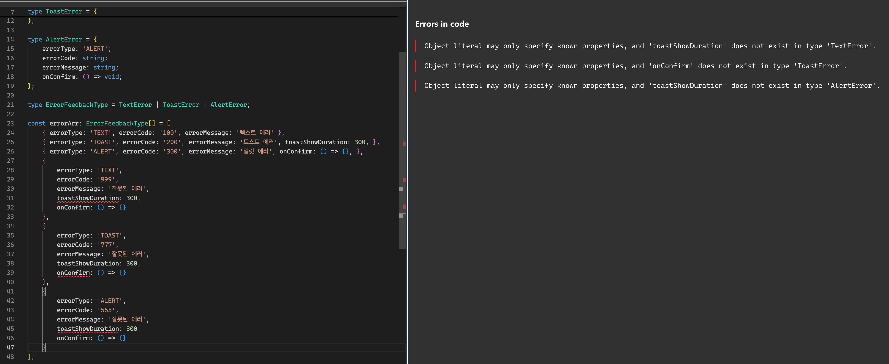

종종 `태그된 유니온`으로도 불리는 `식별할 수 있는 유니온`은 타입 가드에 널리 사용되는 방식임. <br />
예시와 함께 살펴보자

<br />

### 에러 정의하기
---
배민 서비스에서는 선물을 보낼때 사용자가 필요한 값을 올바르게 입력했는지를 확인하는 유효성 검사를 진행함. <br />
이때 다양한 방식으로 에러를 보여주는데, 크게 3가지로 분류함.
- `텍스트 에러`
- `토스트 에러`
- `얼럿 에러`

이들을 모두 동일하게, `errorCode`와 `errorMessage`를 가지고 있지만, 각각 추가로 필요한 정보가 있을 수 있음. 예를 들자면 토스트 에러는 토스트를 얼마나 오래 띄울것인지에 대한 정보가 필요함.
```ts
type TextError = {
  errorCode: string;
  errorMessage: string;
};

type ToastError = {
  errorCode: string;
  errorMessage: string;
  toastShowDuration: number; // 토스트 유지 시간
};

type AlertError = {
  errorCode: string;
  errorMessage: string;
  onConfirm: () => void; // 확인 버튼을 누른 뒤 action
};
```

이 에러 타입의 유니온 타입을 원소로 하는 배열을 정의하면 아래와 같음
```ts
type ErrorFeedbackType = TextError | ToastError | AlertError;

const errorArr: ErrorFeedbackType[] = [
  { errorCode: '100', errorMessage: '텍스트 에러' },
  { errorCode: '200', errorMessage: '토스트 에러', toastShowDuration: 300, },
  { errorCode: '300', errorMessage: '얼럿 에러', onConfirm: () => {}, },
];
```

<br />

여기서 만약 `TextError`, `ToastError`, `AlertError`의 모든 속성을 가지는 에러가 들어온다고 가정해보면
```ts
const unionError = {
  errorCode: '999',
  errorMessage: '잘못된 에러',
  toastShowDuration: 300,
  onConfirm: () => {},
};

errorArr.push(unionError); // ✅ OK
```
이거는 우리가 기대했던 상황이 아니므로 에러를 뱉어야 하는게 맞지만, 덕타이핑 언어의 특성을 가지는 js이기 때문에 별도의 타입 에러가 발생하지 않음. <br />
따라서 이러한 상황에서 에러가 발생하지 않으면 앞으로의 개발 과정에서 알수없는 에러가 많이많이 생기게 될게 뻔함.

<br />

### 식별할 수 있는 유니온
---
따라서 에러 타입을 구분할 방법이 필요한데, 각 타입이 비슷한 구조를 가지지만 서로 호환되지 않도록 하기 위해서는 타입들이 서로 포함 관계를 가지지 않도록 정의해야 함. <br />
***즉, 차별점이 될만한 것들을 정의해두어야 한다는 것.*** <br />
이때 적용할 수 있는 방법이 바로 `식별할 수 있는 유니온`을 활용하는 것임.<br />
`식별할 수 있는 유니온`이란 ***타입간의 구조 호환을 막기 위해 타입마다 구분할 수 있는 유니크한 식별자(판별자)를 달아줘서 포함 관계를 제거하는 것*** 임.

위에서 보았던 예시를 식별자의 개념으로 `errorType`이라는 필드를 추가해서 다시 작성 해본다면
```ts
type TextError = {
  errorType: 'TEXT'; // 식별자
  errorCode: string;
  errorMessage: string;
};

type ToastError = {
  errorType: 'TOAST'; // 식별자
  errorCode: string;
  errorMessage: string;
  toastShowDuration: number;
};

type AlertError = {
  errorType: 'ALERT'; // 식별자
  errorCode: string;
  errorMessage: string;
  onConfirm: () => void;
};
```
이렇게 작성해 볼 수 있음. <br />
`errorType`으로 각각 고유한 식별자를 넣어줌으로써 포함관계를 제거했음.
그렇다면 아까는 에러를 뱉지 않았던 예시를 다시 적용해본다면?


우리가 기대했던 대로 동작함.
유니크한 식별자를 통해서 ts가 타입 추론을 통해서 타입을 좁힌 것.

<br />

### 식별할 수 있는 유니온 판별자 선정
---
식별할 수 있는 유니온을 사용할 때 주의할 점이 있음. <br />
식별할 수 있는 유니온의 판별자(식별자)는 `유닛 타입`으로 선언되어야 한다는 것.
> [!TIP]
> **유닛 타입** <br />
> 다른 타입으로 쪼개지지 않고 오직 하나의 정확한 값을 가지는 타입을 말함. <br />
> ex) `null`, `undefined`, `true`, `1`, `리터럴 타입` 등등..

여러 타입 할당이 가능한 `void`, `string`, `number`, `object`이런 타입들은 유닛 타입으로 분류되지 않음.

실제 ts 깃헙의 <a href='https://github.com/microsoft/TypeScript/issues/30506#issuecomment-474802840'>이슈</a>를 찾아보면 식별자로 사용 가능한 타입을 다음과 같이 정의하고 있음
- ***"리터럴 타입이어야 한다."***
- ***판별자(식별자)로 선정한 값에 적어도 하나 이상의 유닛 타입이 포함되어야 하며, 인스턴스화할 수 있는 타입은 포함되지 않아야 한다.***

```ts
interface A {
    value: 'a';
    answer: 1;
}

interface B {
    value: string;
    answer: 2;
}

interface C {
    value: Error;
    answer: 3;
}

function checkType(param: A | B | C) {
    // 식별자가 param.value일 경우
    if (param.value === 'a') {
        param // A | B 타입으로 좁혀짐
    }

    if (typeof param.value === 'string') {
        param // A | B 타입으로 좁혀짐
    }

    if (param.value instanceof Error) {
        // 인스턴스화 할 수 있는 타입일 경우 타입이 좁혀지지 않음.
        param // A | B | C
    }

    // 식별자가 param.answer일 경우
    if (param.answer === 1) {
        param // A
    }

    if (param.answer === 2) {
        param // B
    }

    if (param.answer === 3) {
        param // C
    }
}
```
이 코드에서는 판별자가 `answer`일 때만 모든 판별자가 유닛 타입이므로 타입이 정상적으로 좁혀지는 것을 알 수 있음.
