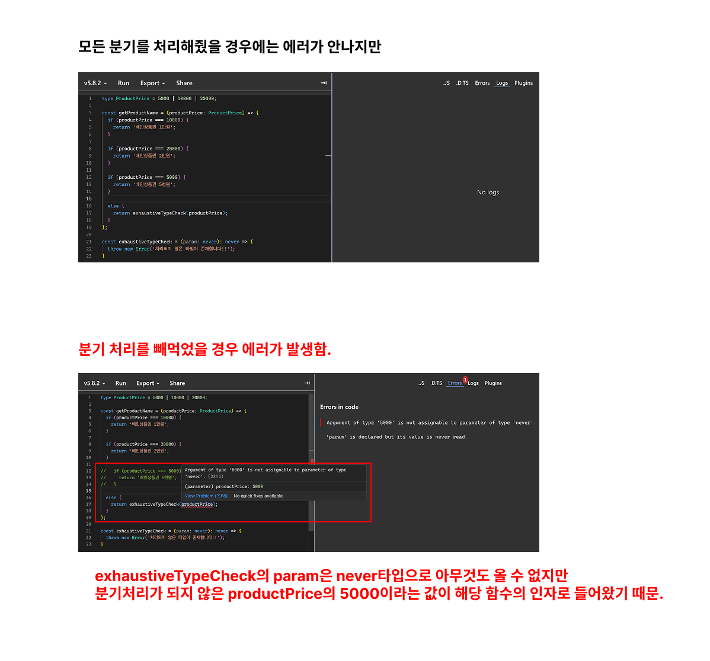

`Exhaustiveness`는 사전적으로 철저함, 완전함을 의미함. <br />
따라서 `Exhaustiveness Checking`은 모든 케이스에 대해 철저하게 타입을 검사하는 것을 말함. <br />
타입 가드를 통해서 타입에 대한 분기 처리를 수행한다면 분기 처리가 필요하다고 생각되는 부분에만 분기처리를 해준다면 요구사항을 만족할 수 있음. 그러나 때로는 모든 케이스에 대해서 분기처리를 해야만 하는 상황이 있을 수 있음. <br />

예를 들어서 살펴보자

<br />

### 상품권
---
배민 서비스에는 다양한 상품권들이 존재함. 상품권의 가격에 따라 상품권의 이름을 반환해주는 함수를 작성하면 다음과 같음.
```ts
type ProductPrice = 10000 | 20000;

const getProductName = (productPrice: ProductPrice) => {
  if (productPrice === 10000) {
    return '배민상품권 1만원';
  }

  if (productPrice === 20000) {
    return '배민상품권 2만원';
  }

  else {
    return '배민상품권';
  }
};
```
해당 코드는 가격에 따라서 이름을 잘 반환하고 있지만, 만약 `ProductPrice`에 `5000`이 새로 추가된다면? <br />
`getProductName`의 코드에도 새로운 분기처리 코드가 추가가 되어야 할것임.
수정을 하지 않아도 에러가 발생 하는것은 아니기 때문에 실수 할 여지도 있음.

<br />

이러한 실수를 방지하기 위해서 모든 타입에 대해서 타입 검사를 강제하고 싶다면 아래와 같이 코드를 작성할 수 있음.

```ts
type ProductPrice = 5000 | 10000 | 20000;

const getProductName = (productPrice: ProductPrice) => {
  if (productPrice === 10000) {
    return '배민상품권 1만원';
  }

  if (productPrice === 20000) {
    return '배민상품권 2만원';
  }

  else {
    exhaustiveTypeCheck(productPrice);
  }
};

const exhaustiveTypeCheck = (param: never): never => {
  throw new Error('처리되지 않은 타입이 존재합니다!!');
}
```



-> 이미지를 보면 타입 분기 처리를 빼먹었을 경우 의도적으로 에러를 발생시킴.

`exhaustiveTypeCheck`의 인자 타입을 `never`로 선언해서 어떤 값도 받지 못하게 한 뒤, 만약 특정 값이 들어오면 에러를 뱉게끔 하는 것임.


이런식으로 모든 타입에 대해서 분기 처리를 하지 않았을 경우 의도적으로 에러를 던져서 컴파일 에러를 유도하는 방식을 `Exhaustiveness Checking`이라고 함.


