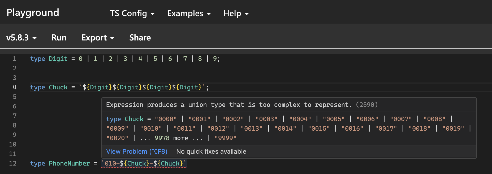

ts4.1부터는 템플릿 리터럴 타입이라는 문법이 등장했음.

```ts
type HeadingNumber = 1 | 2 | 3 | 4 | 5 | 6;
type HeaderTag = `h${HeadingNumber}`; // "h1" | "h2" | "h3" | "h4" | "h5" | "h6"
```

> [!CAUTION]
> **템플릿 리터럴 타입을 사용할 때 주의할 점** <br />
> ts컴파일러가 유니온 타입을 추론하는 경우 시간이 오래 걸리면, 타입을 추론하지 않고 에러를 뱉을 때가 있음. <br />
> 따라서 ts에 삽입된 유니온 조합의 경우의 수가 너무 많지 않도록 나눠서 타입을 정의하는게 좋음
> 
