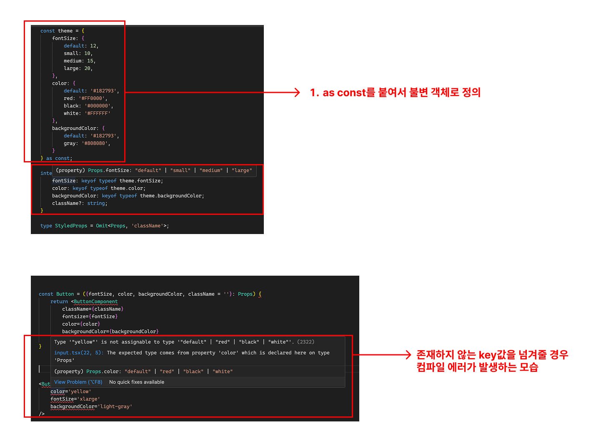

프로젝트를 진행하면서 상숫값을 관리할때 객체를 많이 사용함.
예를 들어서 스타일을 관리하는 `theme`객체, 폰트값을 모아놓은 `fonts`객체, 색깔을 모아놓은 `color`객체등..

근데, 일반적으로 객체를 열린 타입으로(일반 객체로) 사용하게 되면 해당 객체가 return하는 타입은 any가 되버림. <br />
어떤 값이 해당 객체에 더 추가될지 모르기 때문.
```ts
const color = {
    red: '#FF0000',
    black: '#000000',
    white: '#FFFFFF'
};

function getColorCode(key: string) {
    return color[key];
}
```
-> getColorCode의 return타입은 `any`

여기서 `as const`키워드로 객체를 불변 객체로 선언하고, key의 타입을 `keyof typeof color`로 설정해주면, 존재하는 키값에 대해서만 값을 받을 수 있음.
```ts
const color = {
    red: '#FF0000',
    black: '#000000',
    white: '#FFFFFF'
} as const;

function getColorCode(key: keyof typeof color) {
    return color[key];
} // "#FF0000" | "#000000" | "#FFFFFF"
```

또한 객체에 존재하지 않는 키값을 인자로 전달할 경우 컴파일 에러가 발생해서 실수를 방지할 수도 있음. 👍🏻

이를 어떻게 활용할 수 있는지 알아보자

<br />

### Atom컴포넌트에서 활용하기
Atom단위의 작은 컴포넌트(Button, Header, Input 등)는 폰트 크기, 폰트 색상, 배경 색상등 다양한 환경에서 유연하게 사용될 수 있도록 구현되어야 함. <br/>
**이때 컴포넌트에서 props로 직접 넘겨받을 값들을 타입으로 정의해둘 수 있지만, 그렇게 하면 아래와 같은 문제점들이 생김.**
- ***관리포인트가 늘어나게 됨.***
- ***프로젝트에서 사용하지 않는 색상을 props로 넘겨주어도 컴파일 에러가 발생하지 않음.***

예를 들어보자
```ts
const theme = {
    fontSize: {
        default: 12,
        small: 10,
        medium: 15,
        large: 20,
    },
    color: {
        default: '#182793',
        red: '#FF0000',
        black: '#000000',
        white: '#FFFFFF'
    },
    backgroundColor: {
        default: '#182793',
        gray: '#808080',
    }
}

interface Props {
    fontSize: string;
    color: string;
    backgroundColor: string;
    className?: string;
}

interface StyledProps {
    fontSize: string;
    color: string;
    backgroundColor: string;
}

const ButtonComponent = styled.Button<StyledProps>`
    font-size: ${(fontsize) => theme.fontSize[fontsize || 'default']};
    color: ${(color) => theme.color[color || 'default']};
    background-color: ${(backgroundColor) => theme.backgroundColor[backgroundColor || 'default']};
`;


const Button = ({fontSize, color, backgroundColor, className = ''}: Props) {
    return <ButtonComponent
        className={className}
        fontsize={fontSize}
        color={color}
        backgroundColor={backgroundColor}
    />
}

// 이렇게 사용해도 컴파일 에러가 발생하지 않음.
<Button
    color='yellow'
    fontSize='xlarge'
    backgroundColor='light-gray'
/>
```
-> 여기 예시에서는 theme객체에 정의되지 않는 key값을 인자로 넘겨줘도 컴파일 에러가 발생하지 않음. <br />
이거를 아래와 같은 순서로 개선해보자 <br />
1. theme객체를 as const 수식어와 함께 불변객체로 수정
2. props로 theme객체에만 존재하는 key값만 받을 수 있도록 수정
3. StyledProps도 유틸리티 객체 `Omit`을 사용해서 최적화



<br/>

```ts
const theme = {
    fontSize: {
        default: 12,
        small: 10,
        medium: 15,
        large: 20,
    },
    color: {
        default: '#182793',
        red: '#FF0000',
        black: '#000000',
        white: '#FFFFFF'
    },
    backgroundColor: {
        default: '#182793',
        gray: '#808080',
    }
} as const; // 1

interface Props {
    fontSize: keyof typeof theme.fontSize; // 2
    color: keyof typeof theme.color; // 2
    backgroundColor: keyof typeof theme.backgroundColor; // 2
    className?: string;
}

type StyledProps = Omit<Props, 'className'>; // 3

const ButtonComponent = styled.Button<StyledProps>`
    font-size: ${(fontsize) => theme.fontSize[fontsize || 'default']};
    color: ${(color) => theme.color[color || 'default']};
    background-color: ${(backgroundColor) => theme.backgroundColor[backgroundColor || 'default']};
`;

const Button = ({fontSize, color, backgroundColor, className = ''}: Props) {
    return <ButtonComponent
        className={className}
        fontsize={fontSize}
        color={color}
        backgroundColor={backgroundColor}
    />
}

// 이제 에러 발생!!
<Button
    color='yellow'
    fontSize='xlarge'
    backgroundColor='light-gray'
/>
```

이처럼 상숫값의 키값을 추출해서 활용하면 ts의 도움을 받아서 실수를 방지할 수 있음.