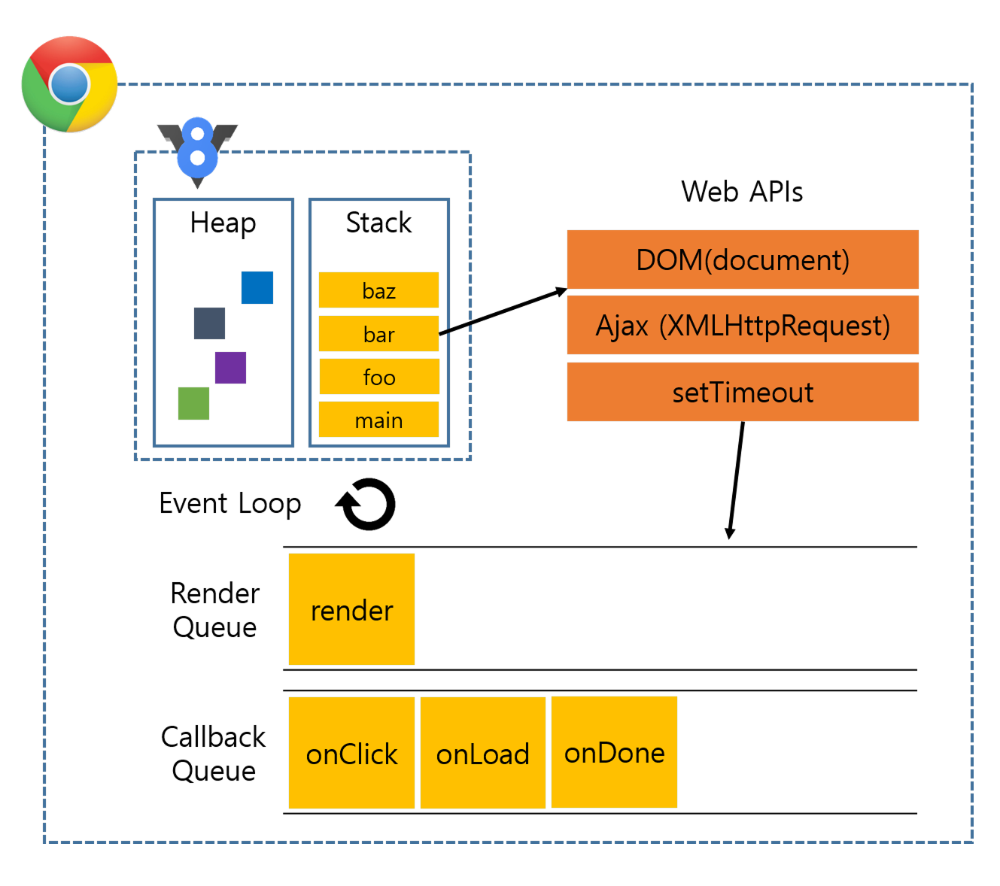

### 런타임과 컴파일타임
---
프로그래밍 언어는 일반적으로 `고수준`과 `저수준`으로 구분됨.
- 고수준 : 사람이 이해하기 쉬운 형식으로 작성된 언어
- 저수준 : 컴퓨터가 이해하기 쉬운 형식으로 작성된 언어

js는 대표적인 고수준 언이이며, 컴파일러에 의해서 저수준 언어로 변역되어서 실행됨.

개발자가 소스코드를 작성하고, 해당 코드는 컴파일러에 의해서 기계어 코드로 변환되어 실행이 가능한 프로그램이 되는데, 이를 `컴파일타임`이라고 함.  
> [!NOTE]
> **컴파일타임**  
> 소스코드가 컴파일 과정을 거쳐서 컴퓨터가 이해할 수 있는 기계어로 바뀌어 실행될 수 있는 프로그램이 되는 괴정.

소스코드가 컴파일이 되어 기계어 코드가 되면 프로그램이 메모리에 적재되어서 실행되는데, 이 시간을 `런타임`이라고 함.
> [!NOTE]
> **런타임**  
> 컴파일 과정을 마친 응용 프로그램이 사용자에 의해 실행되는 과정.

 

### js런타임
---
js 런타임은 js가 실행되는 환경을 말함.(대표적으로 `브라우저`, `nodeJS`가 있음) 
런타임은 다양한 구성요소로 이루어져 있음(js엔진, webAPI, 이벤트루프, 콜백큐 등등..)

-> js런타임 구성요소

 

### 타입스크립트의 컴파일
---
일반적으로 **"컴파일"** 은 고수준 언어에서 저수준 언어로 변환되는 과정을 가리킴.  

타입스크립트는 tsc라는 컴파일러를 통해서 js코드로 변환됨. 하지만 ts는 고수준 언어에서 고수준 언어로(ts to js) 변환되는 것 이기 떄문에 컴파일이 아닌, `트랜스파일` 또는 `source-to-source compiler`라고도 함.

> [!NOTE]
> 트랜스파일의 다른 예시로 C/C++ 코드를 js로 변환하는 `Emscripten`과, `Babel`을 들수있음.

타입스크립트는 `.ts` 파일을 찾아내서 컴파일한 뒤 `.js`파일로 만들어냄.
이때 tsc는 소스코드를 해석해서 `AST(추상 구문 트리)`를 만들고 이후 타입 확인을 거친 뒤에 js코드인 `결과 코드`를 생성함.  
tsc가 ts코드를 컴파일해서 프로그램이 실행되기 까지의 과정은 아래와 같음.

<ol style="font-weight: bold">
  <li>타입스크립트 소스코드를 AST(추상 구문 트리)로 만듬 (tsc)</li>
  <li>타입 검사기가 AST를 확인해서 타입을 확인 함 (tsc)</li>
  <li>타입스크립트 AST를 JS소스코드로 변환함(tsc)</li>
  <li>js소스코드를 AST로 만듦 (런타임)</li>
  <li>AST가 바이트 코드로 변환 됨 (런타임)</li>
  <li>런타임에서 바이트 코드가 실행됨 (런타임)</li>
</ol>

> [!NOTE]
> **AST(추상 구문 트리)**  
> 컴파일러가 소스코드를 해석하는 과정에서 생성되는 데이터 구조.  
> 컴파일러는 `어휘적 분석`과, `구문 분석`을 통해 소스코드를 노드 단위의 트리 구조로 형성함. 이를 AST라고 함.

 

타입스크립트의 타입은 최종적으로 만들어지는 프로그램에는 아무런 영향을 주지 않음. 또한 ts는 컴파일 타임에 타입을 검사하기 때문에 에러가 발생하면 프로그램이 실행되지 않음.  
이러한 특징 떄문에 ts를 `정적 타입 검사기`라고 부름.