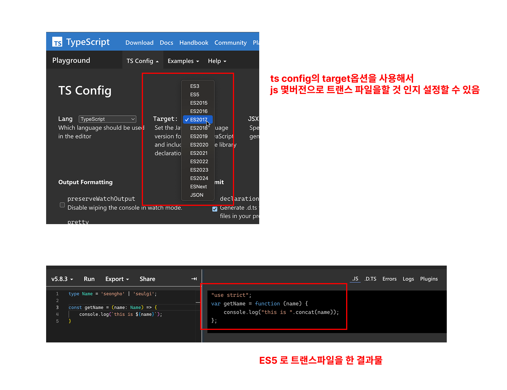

앞서 우리는 타입스크립트 컴파일 과정의 전반적인 흐름에 대해 살펴보았음. <br />
이번 절에서는 tsc의 주요 역할에 대해서 살펴보자

<br />

### 코드 검사기로서의 tsc
---
tsc는 코드 타입에 어류가 없는지를 확인함.<br />
ts는 컴파일타임에 코드 타입을 확인하기 때문에 코드를 실행하지 않고도, 에러가 있다는 것을 바로알 수 있음. 따라서 ts는 정적으로 코드를 분석하여 에러를 검출하며, 코드를 실행하기 전에 에러를 사전에 알려줌.<br />

아래 예시를 살펴보자

```js
// js
const dev = {
  work() {
    console.log('work');
  }
}

dev.sleep(); // ✅
```
해당 코드는 js였다면 코드를 작성하는 시점에서는 에러가 발생하지 않음. 그러나, 실제 실행을 하면 에러가 발생함. <br/>
같은 코드를 ts로 작성하게 되면 코드를 실행하기 전에 에러를 발견해서 알려줌

```ts
// ts
const dev = {
  work() {
    console.log('work');
  }
}

dev.sleep(); // Error! Property 'sleep' does not exist on type '{ work(): void; }'
```
이처럼 ts는 js였다면 런타임에서 발견할 수 있는 에러를 컴파일 타임에 발견해서 실행과정에서 발생할 수 있는 문제를 방지함.

tsc는 <a href="https://github.com/microsoft/TypeScript/blob/main/src/compiler/binder.ts">tsc binder</a>를 사용해서 타입 검사를 하며, 컴파일 타임에 오류를 발견함. <br/>
이후 타입 검사를 거쳐서 AST를 js코드로 변환함. (tsc binder는 ts깃헙에 정의되어져 있음)

<br/>

### 코드 변환기로서의 타입스크립트 컴파일러
---
tsc는 타입검사를 한 뒤에, 구버전의 js로 트랜스파일을 함. 이것이 tsc의 두번째 역할임. <br />
tsc의 `target`옵션을 사용해서 특정 버전의 js소스코드로 변환할 수 있음.


tsc는 타입 검사를 수행한 후 코드 변환을 시작하는데, 이때 타입 오류가 있더라도 일단 컴파일을 진행함. <br/>
ts코드가 js코드로 변환되는 과정은 타입 검사와 독립적으로 이루어지기 때문임.
따라서 ts코드의 타이핑이 잘못되어서 발생하는 에러는 js를 실행하는 과정에서 런타임 에러로 처리 됨.
```ts
const naming: string = 'zig';
const age: number = 'zig';
```
-> 해당 코드는 타입 에러가 있지만 트랜스파일은 진행 됨.

```ts
// 컴파일 이후 js소스코드
"use strict";

const naming = 'zig';
const age = 'zig';
```

ts를 컴파일하게 되면 순수js만 남고, 런타임에서는 타입 검사를 할수없기 때문에 주의해야 하는 경우도 있음.
```ts
interface Name {
  name: string;
}

function getName(name: Name) {
  if (name instanceof Name) { // Error! 'Name' only refers to a type, but is being used as a value here
    // ...
  }
}
```
위 코드는 `instanceof`는 런타임에 실행되지만, `Name`은 타입이기 때문에 런타임은 해당 코드를 이해하지 못함.
정리하자면 tsc의 역할은 크게 2가지로 볼수 있음.
- **코드의 타입 오류검사**
- **최신버전의 ts나 js를 구버전의 js로 트랜스파일**

> [!TIP]
> ***그러면 바벨과는 뭐가 다른거죠?*** <br />
> 바벨은 타입 검사를 하지 않고, 최신버전의 js코드를 구버전의 js로 컴파일 하는것이 주된 역할임.
