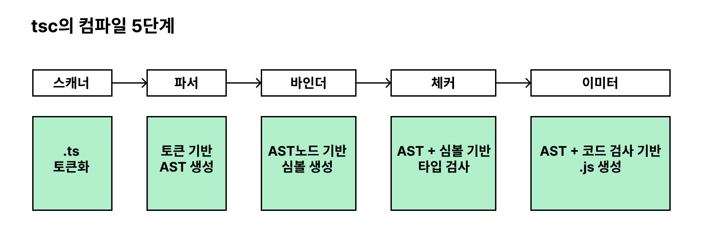
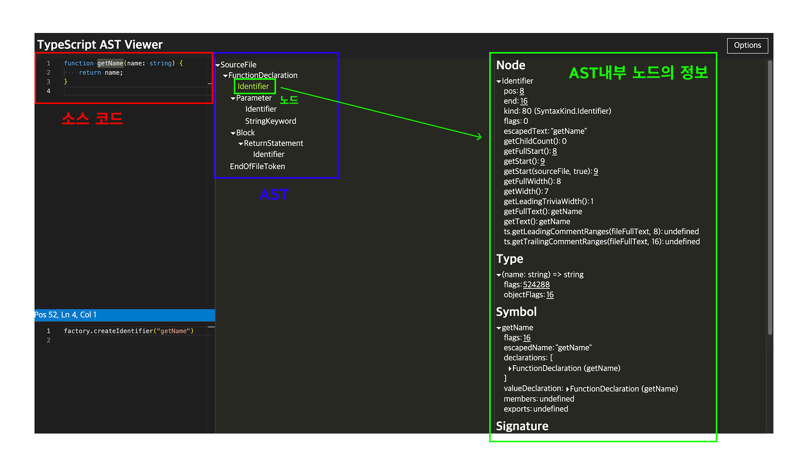
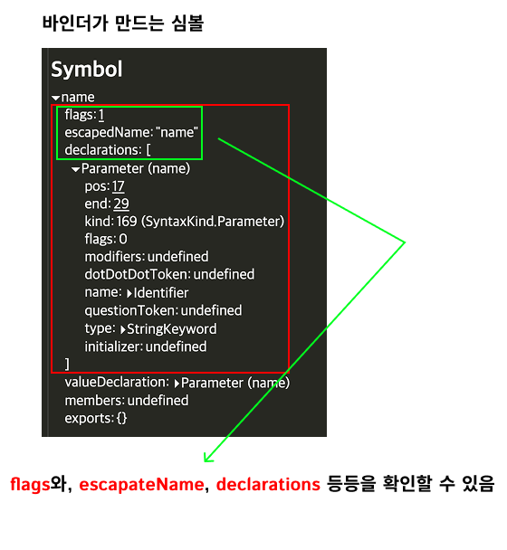

여기서는 실제 tsc의 구성 요소를 훑어보며 tsc의 동작 방식을 톮아보자<br/>

컴파일러는 하나의 프로그램으로, 이를 구현한 소스파일이 존재함.
타입스크립트의 공식문서에서도 찾아볼 수 있음.<br />
<a href="https://github.com/microsoft/TypeScript/tree/main/src/compiler">-> 링크</a>

tsc는 아래와 같은 5가지 단계를 거쳐서 소스 변환을 진행함.


<br/>

### 0. 프로그램
---
컴파일러는 tsconfig에 명시된 컴파일 옵션을 기반으로 `'tsc'`라는 명령어로 실행됨. <br/>
우선적으로 컴파일 과정을 관리하는 컴파일 객체가 생성되고, 해당 객체는 컴파일을 할 `ts소스파일`과, 해당 파일에서 `import`하는 파일들을 불러오는데 이때 가장 첫번재로 불러온 파일을 기준으로 컴파일을 시작함.

<br/>

### 1. 스캐너
---
ts코드를 js로 변환하기 위한 첫번째 단계는 `스캐너`임.<br />
스캐너는 ts소스 파일을 어휘적으로 분석해서 `토큰`을 생성함. 즉, 소스코드를 작은 단위로 나누어서 의미있는 토큰으로 변환하는 작업을 수행함. <br />
```ts
const name = 'seongho';
```
예를 들어서 위와 같은 코드는 아래처럼 `토큰화` 됨.


<br />

### 2. 파서
---
스캐너가 소스파일을 토큰으로 나눠주면 파서는 해당 토큰을 이용해서 `AST`를 생성함. <br/>
`AST`는 컴파일러가 동작하는게 가장 핵심 기반이 되는 자료구조로써, 소스코드를 트리형태의 구조로 표현함. AST의 최상위 노드는 타입스크립트 소스파일이며, 마지막 리프노드는 `EOF 토큰`으로 구성됨. <br/>
파서는 토큰을 이용해서 `구분적 분석(Syntax analysis)`을 수행함. <br/>
AST의 각각의 노드는 `코드상의 위치`, `구문 종류`, `코드 내용`과 같은 정보를 담고있음.<br/>
예를 들어서 토큰에 `()`에 해당하는 토큰이 있을 경우, AST를 생성하는 과정에서 해당 토큰이 **함수의 호출**인지, **함수의 인자**인지 또는 **그룹 연산자**인지가 결정 됨.

예시를 봐보자



-> 해당 이미지는 `AST`와 함수의 이름인 `getName`에 해당하는 노드에 대한 정보를 보여주고 있음.

<br />

### 3. 바인더
---
바인더의 주요 역할은 ***체커 단계(4단계)에서 타입 검사를 할 수 있도록 기반을 마련하는 것*** 임. 바인더는 타입 검사를 위해서 `심볼`이라는 데이터 구조를 생성함.<br />
심볼은 이전 단계의 AST에서 선언된 타입의 노드 정보를 저장함. 심볼의 구성은 아래와 같음.
```ts
export interface Symbol {
  flags: SymbolFlags;
  escapeName: string;
  declarations?: Declaration[];
  // ...
}
```

<br />

여기서 `flags`는 AST에서 선언된 타입의 노드 정보를 저장하는 식별자임.
```ts
// flag에 해당하는 SymbolFlags타입\
export const enum SymbolFlags {
  None = 0,
  FunctionScopedVariable = 1 << 0, // Variable(var) or parameter
  BlockScopedVariable = 1 << 1, // a block-scoped variable (let, const)
  Property = 1 << 2, // Property or enum member
  EnumMember = 1 << 3, // Enum member
  Function = 1 << 4, // Function
  Class = 1 << 5, // Class
  Interface = 1 << 6, // Interface
  // ...
}
```

<br />

`declaration`필드는 AST노드의 배열 형태를 보임.<br />



즉, 바인더는 `심볼`을 생성하고, 해당 심볼과 그에 대응하는 AST노드를 연결하는 역할을 수행함.

<br />

### 4. 체커와 이미터
---
- `check`: 확인하다
- `emit`: 내보내다 또는 방출하다

`체커`는 파서가 생성한 `AST`와 `바인더`가 생성한 `심볼`을 활용해서 타입 검사를 수행함.

체커의 주요 역할은 AST를 탐색하면서 심볼 정보를 불러와 주어진 소스 파일에 대해서 타입 검사를 진행하는 것임. 체커의 타입 검사는 다음 단계인 이미터 단계에서 실행 됨. <br/>
checker.ts의 getDiagnostics 함수를 사용해서 타입을 검증하고, 에러가 있다면 어떤 에러를 띄울지를 저장함.

이미터는 `타입스크립트 소스파일`을 `js소스파일`과, `타입 선언 파일d(d.ts)`로 나눠서 생성함. 이미터는 ts파일을 변환하는 과정에서 tsconfig파일을 불러오고, 체커를 통해서 코드에 대한 타입 검증 정보를 가져옴. <br />

이후 emit이라는 의미에 맞게 `emitter.ts` 내부의 `emitFiles()` 함수를 사용해서 코드 변환을 진행함.

tsc의 컴파일 과정을 정리하자면 아래와 같음.
<ol
  style="font-weight: bold; font-style: italic;"
>
  <li>'tsc'라는 명령어로 프로그램 객체를 생성해서 컴파일을 시작함</li>
  <li>스캐너가 소스코드를 토큰으로 분해함</li>
  <li>파서는 해당 토큰을 기반으로 AST를 만듦</li>
  <li>바인더는 해당 AST를 기반으로 각각의 노드에 대한 심볼을 생성함</li>
  <li>체커는 AST를 순회하며 각 노드에 상응하는 심볼 정보를 가지고 타입 검사를 진행함</li>
  <li>이미터를 사용해서 js파일로 변환함</li>
</ol>
