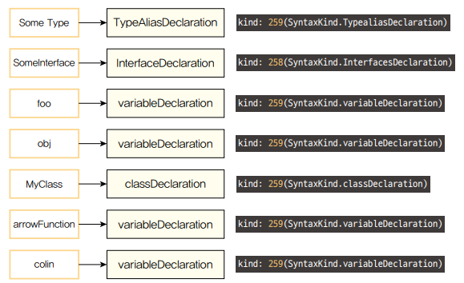

# 3. 타입스크립트 컴파일러의 구조

타입스크립트 컴파일러가 동작하는 데 중요한 몇 가지 중요한 구성 요소가 있다.
타입스크립트 컴파일러의 구체적인 동작을 살펴보자.

| 순서 | 단계   | 설명                          |
| ---- | ------ | ----------------------------- |
| 1    | 스캐너 | .ts 토큰화                    |
| 2    | 파서   | 토큰 기반 AST 생성            |
| 3    | 바인더 | AST 노드 기반 심볼 생성       |
| 4    | 체커   | AST + 심볼 기반 타입 검사     |
| 5    | 이미터 | AST + 코드 생성 기반 .js 생성 |

> 위의 5단계를 거쳐 타입 검사와 자바스크립트 소스 변환을 진행한다.

<br />
<br />

## 1) 프로그램(Program)

타입스크립트 컴파일러는 tsc명령어로 실행된다.<br />
컴파일러는 tsconfig.json에 명시된 컴파일 옵션을 기반으로 컴파일을 수행한다.

전체적인 컴파일 과정을 관리하는 프로그램 객체(인스턴스)가 생성되고,<br />
객체 내 컴파일할 타입스크립트 소스 파일과 소스 파일 내 임포트된 파일을 불러오는데<br />
가장 최초 불러온 파일을 기준으로 컴파일 과정이 시작된다.

<br />
<br />

## 2) 스캐너(Scanner)

스캐너는 타입스크립트 소스 파일을 어휘적으로 분석하여 토큰을 생성하는 역할을 한다.<br />
소스코드를 작은 단위로 나누어 의미 있는 토큰으로 변환하는 작업을 수행한다.

```ts
// 코드는 스캐너에 의해 다음과 같은 토큰으로 분석된다.
const woowa = "bros";
```

- ConstKeyword: const
- WhitespaceTrivia: (공백)
- Identifier: woowa
- WhitespaceTrivia: (공백)
- EqualsToken: =
- WhitespaceTrivia: (공백)
- StringLiteral: "bros"
- SemicolonToken: ;

<br />
<br />

## 3) 파서(Parser)

스캐너가 소스 파일을 토큰으로 나눠주면, 파서는 그 토큰 정보를 이용하여 AST를 생성한다.

파서는 생성된 토큰 목록을 활용하여 구문적 분석을 수행한다.

코드의 실질적인 구조를 노드 단위의 트리 형태로 표현하고,<br />
각각의 노드는 코드상의 위치, 구문 종류, 코드 내용과 같은 정보를 담는다.

### AST?

컴파일러가 동작하는 데 핵심 기반이 되는 자료 구조로,<br />
소스코드의 구조를 트리 형태로 표현한다.

AST의 최상위 노드는 타입스크립트 소스 파일이며,<br />
최하위 노드는 파일의 끝 지점으로 구성된다.

<br />
<br />

## 4) 바인더(Binder)

체커 단계에서 타입 검사를 할 수 있도록 기반을 마련하는 역할은 한다.<br />
바인더는 타입 검사를 위해 심볼이라는 데이터 구조를 생성한다.

심볼은 이전 단계의 AST에서 선언된 타입의 노드 정보를 저장한다.

```ts
export interface Symbol {
  flags: SymbolFlags; // Symbol flags
  escapedName: string; // Name of Symbol
  declarations?: Declaration[];
  // ...
}

// src/compiler/types.ts
export const enum SymbolFlags {
  	NONE					= 0,
  	FunctionScopedVariable	= 1 << 0, // Variable (var) or parameter
    BloackScopedVariable	= 1 << 1, // A block-scoped variable (let or const)
  	Property				= 1 << 2, // Property or enum member
  	EnumMember				= 1 << 3, // Enum member
  	Function				= 1 << 4, // Function
  	Class					= 1 << 5, // Class
  	Interface				= 1 << 6, // Interface
  	...
  	..
  	.
}
```

- flags 필드는 AST에서 선언된 타입의 노드 정보를 저장하는 식별자이다.
- 심볼 인터페이스의 declarations 필드는 AST 노드의 배열 형태를 보인다.

> 바인더는 심볼을 생성하고 해당 심볼과 그에 대응하는 AST 노드를 연결하는 역할을 한다.

```ts
type SomeType = string | number;
interface SomeInterface {
  name: string;
  age?: number;
}

let foo: string = "LET";
const obj = {
  name: "이름",
  age: 10,
};

class MyClass {
  name;
  age;

  constructor(name: string, age?: number) {
    this.name = name;
    this.age = age ?? 0;
  }
}

const arrowFunction = () => {};
function func() {}

arrowFunction();
func();

const colin = new Class("colin");
```



<br />
<br />

## 5) 체커(Checker)와 이미터(Emitter)

### 체커?

체커는 파서가 생성한 AST와 바인더가 생성한 심볼을 활용해 타입 검사를 수행한다.

체커의 주요 역할은 AST의 노드를 탐색하면서<br />
심볼 정보를 불러와 주어진 소스 파일에 대해 타입 검사를 진행하는 것이다.<br />
체커의 타입 검사는 다음 컴파일 단계인 이미터에서 실행된다.

checker.ts의 getDiagnostics() 함수를 사용해 타입을 검증하고<br />
타입 에러에 대한 정보를 보여줄 에러 메시지를 저장한다.

### 이미터?

타입스크립트 소스 파일을 변환하는 역할을 한다.<br />
즉, 타입스크립트 소스를 자바스크립트 파일(.js)과 타입 선언 파일(d.ts)로 생성한다.

타입스크립트 소스 파일을 변환하는 과정에서<br />
개발자가 설정한 타입스크립트 설정파일을 읽어오고,<br />
체커를 통해 코드에 대한 타입 검증 정보를 가져온다.

emitter.ts 소스 파일 내부의 emitFiles() 함수를 사용해<br />
타입스크립트 소스 변환을 진행한다.

<br />
<br />

## 6) 타입스크립트의 컴파일 과정

1. tsc 명령어를 실행해 프로그램 객체가 컴파일 과정을 시작한다.
2. 스캐너는 소스 파일을 토큰 단위로 분리한다.
3. 파서는 토큰을 이용해 AST를 생성한다.
4. 바인더는 AST의 각 노드에 대응하는 심볼을 생성한다. 심볼은 선언된 타입의 노드 정보를 담고 있다.
5. 체커는 AST를 탐색하며 심볼 정보를 활용해 타입 검사를 수행한다.
6. 타입 검사 결과 에러가 없다면 이미터를 사용해서 자바스크립트 소스 파일로 변환한다.

<br />
<br />
