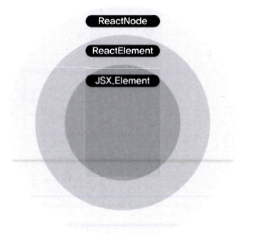
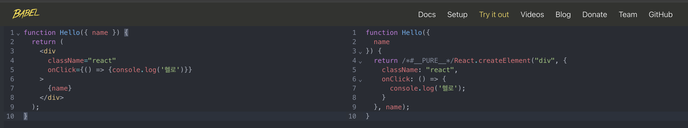
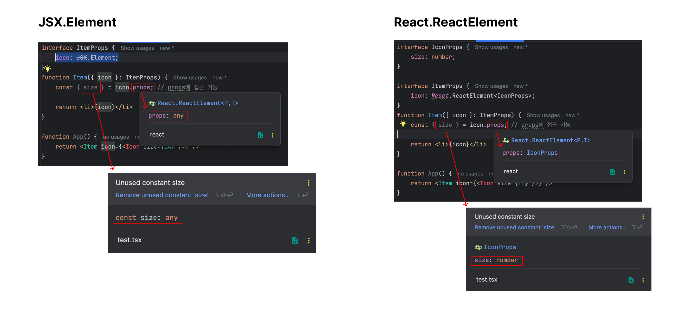

리액트 애플리케이션을 타입스크립트로 작성하면 `@types/react` 패키지에 정의된 내장 타입을 많이 사용하게 됨. <br />
이번 절에서는 어떤 타입들이 있고, 어떨때 사용하면 좋을지 살펴보자.

<br />

### 클래스형 컴포넌트 타입
---
클래스 컴포넌트가 상속받는 `React.Component`와 `React.PureComponent`는 아래와 같음
```ts
interface Component<P = {}, S = {}, SS = any> extends ComponentLifeCycle<P, S, SS> {}

class Component<P, S> {
  // ...
}

class PureComponent<P = {}, S = {}, SS = any> extends Component<P, S, SS> {}
```
여기서 `P`와 `S`는 각각 `Props`와 `State`를 의미함.

예시를 봐보자
```ts
interface Props {
  name: string;
}

// Person컴포넌트
class Person extends React.Component<Props> {
  // ...
}
```

<br />

### 함수형 컴포넌트 타입
```ts
// 함수 선언 방식
function Welcome(props: Props): JSX.Element {}

// 함수 표현식 방식(React.FC 사용)
const Welcome:React.FC<Props> = ({ name }) => {};

// 함수 표현식 방식(React.VFC 사용)
const Welcome: React.VFC<Props> = ({ name }) => {};

// 함수 표현식 방식(JSX.Element를 반환 형식으로 지정)
const Welcome = ({ name }: Props): JSX.Element => {};

type FC<P = {}> = FunctionComponent<P>;
type VFC<P = {}> = VoidFunctionComponent<P>;

// ...중략
```

`React.FC` 또는 `React.VFC`는 리액트에서 함수 컴포넌트의 타입 지정을 위해서 제공되는 타입으로,
함수 표현식을 사용하여 함수 컴포넌트를 사용할 때 가장 많이 사용하는 형태임.
> [!TIP]
> `FC`는 FunctionComponent의 약자, `VFC`는 VoidFunctionComponent의 약자

***`React.FC`와 `React.VFC`는 `children`타입을 허용하는지 아닌지에 따른 차이를 보임.*** <br />

기존의 `React.FC`는 암묵적으로 children을 허용했고, `VFC`는 허용하지 않았지만 <br />
**React18로 넘어오면서 `VFC`는 삭제되고, `FC`에서 `children`이 사라졌음**.

<br />

### Children Props 타입 지정
---
```ts
type PropsWithChildren<P> = P & { children?: ReactNode | undefined };
```
가장 일반적인 `children`타입은 `ReactNode | undefined`임. <br />
만약 더 구체적으로 타이핑을 하고싶다면 `children`에 대해서 추가적으로 타이핑을 해주어야 함.
```ts
// 1
interface Props {
  children: '오성호' | '커피';
}

// 2
interface Props {
  children: string;
}
```

<br />

### render메서드 함수와 컴포넌트 반환 타입 (`ReactElement` vs `JSX.Element` vs `ReactNode`)
---
> [!TIP]
> **리액트 타입들** <br />
> 리액트 타입들은 <a href='https://github.com/DefinitelyTyped/DefinitelyTyped/blob/master/types/react/index.d.ts' target='_blank'> DefinitelyTyped</a> 에 있는 react 폴더에서 찾을 수 있음.

<br />

1. `ReactElement`
```ts
interface ReactElement<
    P = unknown,
    T extends string | JSXElementConstructor<any> = string | JSXElementConstructor<any>,
> {
    type: T;
    props: P;
    key: string | null;
}
```
`ReactElement`는 이처럼 정의됨

jsx를 트랜스파일을 통해서 js로 바꾸면 `React.createElement`가 반환하는 타입은 `ReactElement`임. <br />
리액트는 실제 DOM이 아닌 **가상 DOM**을 기반으로 렌더링하는데, 이때 **가상 DOM**은 ReactElement형태로 저장됨.
즉, `ReactElement`는 리액트가 컴포넌트를 객체 형태로 저장하기 위한 포맷임.

<br />


2. `JSX.Element`
```ts
declare global {
  namespace JSX {
    interface Element extends React.ReactElement<any, any> {}
  }
}
```
`JSX.Element`타입은 `ReactElement`타입을 확장하는 타입임.

<br />

3. `React.Node`
```ts
type ReactText = string | number;
type ReactChild = ReactElement | ReactText;
type ReactFragment = {} | Iterable<ReactNode>;

type ReactNode =
  | ReactChild
  | ReactFragment
  | ReactPortal
  | boolean
  | null
  | undefined;
```
`ReactNode`는 `ReactElement`외에도 많은 타입을 포함하고 있음.

`React.Node`, `React.ReactElement`, `JSX.Element`의 포함관게를 도식화 하면 아래와 같음.


<br />

### ReactNode, ReactElement, JSX.Element 활용하기
---
리액트는 왜 리액트 요소를 나타내는 타입이 3개나 있을까? 각각 언제 사용하고 어떻게 사용해야 하는지 알아보자.

그 전에 먼저 정의된 타입을 좀 더 자세하게 살펴보자

<br/>

- ### ReactElement

  `JSX`는 `React.createElement`메서드를 호출하기 위한 문법으로, 리액트에서 UI를 표현하는데 사용되는 JS의 확장 문법임.<br />
  트랜스파일러는 jsx문법을 `createElement` 메서드 호출문으로 반환하여 리액트 엘리먼트를 생성함.
  
  -> JSX를 바벨로 트랜스파일을 하면 `React.createElement`가 되는 것을 볼 수 있음.

  리액트는 이런식으로 만들어진 리액트 엘리먼트 객체를 읽어서 DOM을 구상함.
  <br />

  ***정리하자면 `ReactElement`는 `createElement`메서드 호출로 생성 된 리액트 엘리먼트를 나타내는 타입임.***

<br />

- ### ReactNode

  `ReactNode`전에 `ReactChild`타입을 살펴보자
  ```ts
  type ReactText = string | number;
  type ReactChild = ReactElement | ReactText;
  ```
  `ReactChild`타입은 `ReactElement`보다 조금 더 넓은 범위를 갖고있음.

  <br />

  ```ts
  // Iterable 타입
  interface Iterator<T, TReturn = any, TNext = undefined> {
    next(...args: [] | [TNext]): IteratorResult<T, TReturn>;
    return?(value?: TReturn): IteratorResult<T, TReturn>;
    throw?(e?: any): IteratorResult<T, TReturn>;
  }

  interface Iterable<T> {
    [Symbol.iterator](): Iterator<T>;
  }

  type ReactFragment = {} | Iterable<ReactNode>; // ReactNode의 배열 형태

  type ReactNode =
  | ReactChild
  | ReactFragment
  | ReactPortal
  | boolean
  | null
  | undefined;
  ```
  즉, `ReactNode`는 리액트의 `render`함수가 반환할 수 있는 모든 형태를 담고 있음

- ### JSX.Element
  ```ts
  declare global {
    namespace JSX {
      interface Element extends React.ReactElement<any, any> {}
    }
  }
  ```
  `JSX.Element`는 `ReactElement`타입의 `T`와 `P`를 `any`로 제한하는 타입임을 알 수 있음.

<br />

### 사용 예시
---
위에서 본 3가지 타입의 공톰점은 모두 리액트 요소를 나타낸다는 것임. 그럼 언제 어떻게 사용하는게 좋을까?

- ### ReactNode
  ReactNode타입은 `composition`모델을 사용할 때 활용하기 좋은데
  ***어떤 타입이든 children props로 다양하게 지정할 수 있게 하고싶다면***  ReactNode타입을 사용할 수 있음.
  ```ts
  type ChildrenWithProps<P> = P & { children?: ReactNode }

  interface WelcomeProps = {
    // ...
  }

  type WelcomeComponentProps = ChildrenWithProps<WelcomeProps>;
  ```
  이런식으로 `ReactNode`는 prop으로 리액트 컴포넌트가 다양한 형태를 가질 수 있게 하고 싶을때 유용하게 사용됨.

  > [!NOTE]
  > **composition모델** <br />
  > 어떤 컴포넌트들은 어떤 자식 엘리먼트가 들어올 지 미리 예상할 수 없는 경우가 있음.<br />
  > 범용적인 박스 역할을 하는 Sidebar 혹은 Modal과 같은 컴포넌트에서 특히 자주 볼 수 있음. <br />
  > 이러한 컴포넌트에서는 특수한 `children` prop을 사용하여 자식 엘리먼트를   렌더링하는 패턴을 말함.

<br />

- ### JSX.Element
  JSX.Element는 리액트 엘리먼틑 Props로 받아서 render props패턴으로 컴포넌트를 구현할 때 유용하게 사용 됨.
  ```tsx
  interface ItemProps {
    icon: JSX.Element;
  }
  function Item({ icon }: ItemProps) {
    const { size } = icon.props; // props에 접근 가능

    return <li>{icon}</li>
  }

  function App() {
    return <Item icon={<Icon size={14} />} />
  }
  ```
  이렇게 `JSX.Element`로 선언하면 해당 컴포넌트의 props에 접근할 수 있다는 장점이 있음.

<br />

- ### ReactElement
  `ReactElement`는 `JSX.Element`와 매우 비슷하지만 JSX.Element는 props의 타입이 any로 추론되는것에 반해 ReactElement는 props의 타입을 제네릭으로 명시해줄 수 있어서, 타입 추론이 가능하다는 장점이 있음.
  ```ts
  interface IconProps {
    size: number;
  }

  interface ItemProps {
      icon: React.ReactElement<IconProps>;
  }
  function Item({ icon }: ItemProps) {
      const { size } = icon.props; // IconProps로 타입이 추론 된 props에 접근 가능

      return <li>{icon}</li>
  }

  function App() {
      return <Item icon={<Icon size={14} />} />
  }
  ```

  

<br />

### 리액트에서 기본 HTML 요소 타입 활용하기
---
리액트를 사용하면서 공통 컴포넌트들을 만들때는 고려사항이 있음.<br />
예를 들어서 `Button`컴포넌트를 만든다고 한다면, 기존의 `HTML native button`태그가 지원하는 모든 핸들러와 같은 기능들을 지원해야 한다는 것임.

만약, `Button`컴포넌트에 `onClick` props가 없다면... 해당 컴포넌트는 클릭 이벤트를 달 수 없는 버튼 컴포넌트가 되버릴 것임.😱

이번에는 기존 HTML태그의 속성 타입을 활용하여 타입을 지정하는 방법을 알아보자

<br />

### DetailedHTMLProps와 ComponentWithoutRef
---
HTML속성 타입을 활용하는 방법은 크게 `DetailedHTMLProps`와 `ComponentWithoutRef` 2가지가 있음.

- ### DetailedHTMLProps
  `DetailedHTMLProps`는 아래와 같이 선언 되어져 있음
  ```ts
  type DetailedHTMLProps<E extends HTMLAttributes<T>, T> = ClassAttributes<T> & E;
  ```

  <br />

  활용할 때는 아래와 같이 활용할 수 있음
  ```ts
  type NativeButtonProps = DetailedHTMLProps<
    HTMLAttributes<HTMLButtonElement>,
    HTMLButtonElement
  >;

  type ButtonProps = {
    onClick: NativeButtonProps['onClick'];
  }
  ```

  <br />

- ### ComponentWithoutRef
  `ComponentWithoutRef`는 아래와 같이 활용할 수 있음.
  ```ts
  type NativeButtonProps = React.ComponentWithoutRef<'button'>;

  type ButtonProps = {
    onClick: NativeButtonProps['onClick'];
  }
  ```
  `ComponentWithoutRef`에는 `ref`에 대한 타입이 정의되어져 있지 않음.

<br />

그렇다면 언제 `ComponentWithoutRef`를 사용하면 좋을까?<br />

위에서 가정한 것의 연장선으로 HTML button태그와 동일한 역할을 하지만 커스텀한 UI를 적용하여 재사용성을 높힌 `Button 컴포넌트`를 만드는데,<br/>
컴포넌트 내에서 `ref`를 활용하여 생성된 DOM 노드에 점급하는 것과 마찬가지로 `Button 컴포넌트` 역시 마찬가지로 props로 전달된 ref를 통해 button태그에 접근할 수 있도록 해야 할 것임.

근데, react 18버전을 기준으로 **함수형 컴포넌트는 Button컴포넌트가 `ref`를 props로 받고, 내부의 button 태그에 할당을 해도 ref가 해당 button태그를 바라보지 않음.** <br />
이러한 제약을 극복하고, 함수형 컴포넌트에서도 ref를 전달받을 수 있도록 해주는 것이 리액트의 `forwardRef` 메서드임.

```ts
interface ForwardRefRenderFunction<T, P = {}> {
  (props: P, ref: ForwardedRef<T>): ReactElement | null;
  displayName?: string | undefined;
  propTypes?: any;
}

function forwardRef<T, P = {}>(
  render: ForwardRefRenderFunction<T, P>
  ): ForwardRefExoticComponent<PropsWithoutRef<P> & RefAttributes<T>>;
```
`forwardRef`는 2개의 제네릭 인자를 받을 수 있는데, 첫번째는 ref에 대한 정보이며, 두번째는 `props`에 대한 타입 정보임

그렇다면 `Button 컴포넌트`는 어떻게 타입 선언을 해야 할까?

```tsx
type NativeButtonProps = React.ComponentWithoutRef<'button'>;

const Button = forwardRef<HTMLButtonElement, NativeButtonProps>(
  (props, ref) => {
    return (
      <button ref={ref}>
        버튼
      </button>
    );
  }
);
```
만약, 이러한 상황에서 함수 컴포넌트의 props로 `DetailedHTMLProps`와 같은 `ref`타입을 포함하는 타입을 사용하게 되면, 실제로는 동작하지 않는 `ref`를 받도록 타입이 지정되어서 예기치 못한 에러를 발생시킬 수 있음.

> [!TIP]
> React가 `19`버전으로 들어서면서 `forwardRef`가 삭제되고, 함수 컴포넌트도 props를 통해서 바로 ref를 전달받을 수 있게 되었음.
