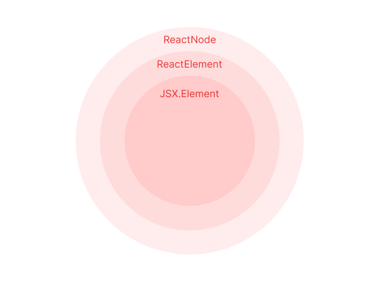

# 리액트 컴포넌트의 타입

리액트 애플리케이션을 타입스크립트로 작성할 때 @types/react 패키지에 정의된<br />
리액트 내장 타입을 사용해본 경험이 있을 것이다.

이 장에서는 헷갈릴 수 있는 대표적인 리액트 컴포넌트 타입을 살펴보면서<br />
상황에 따라 어떤 것을 사용하면 좋을지 그리고 사용할 때의 유의점은 무엇인지 알아보자.

<br />
<br />

## 1) 클래스 컴포넌트 타입

```ts
interface Component<P = {}, S = {}, SS = any>
  extends ComponentLifecycle<P, S, SS> {}

class Component<P, S> {
  // ...
}

class PureComponentM<P = {}, S = {}, SS = any> extends Component<P, S, SS>;
```

클래스 컴포넌트가 상속받는 React.Component와 React.PureComponent의<br />
타입 정의는 위와 같고 P와 S는 각각 props와 상태를 의미한다.

props와 상태 타입을 제네릭으로 받고 있고,<br />
아래처럼 Welcome 컴포넌트 props 타입을 지정해보면 아래와 같다.

```ts
interface WelcomeProps {
  name: string;
}

class Welcome extends React.Component<WelcomeProps> {
  // 생략
}
```

> 상태가 있는 컴포넌트일 때는 제네릭의 두 번째 인자로 타입을 넘겨주면 상태에 대한 타입을 지정할 수 있다.

<br />
<br />

## 2) 함수 컴포넌트 타입

```ts
// 함수 선언을 사용한 방식
function Welcome(props: WelcomeProps): JSX.Element {}

// 함수 표현식을 사용한 방식 - React.FC 사용
const Welcome: React.FC<WelcomeProps> = ({ name }) => {};

// 함수 표현식을 사용한 방식 - React.VFC 사용
const Welcome: React.VFC<WelcomeProps> = ({ name }) => {};

// 함수 표현식을 사용한 방식 - JSX.Element를 반환 타입으로 지정
const Welcome = ({ name }: WelcomeProps): JSX.Element => {};

// 타입 정의
type FC<P = {}> = FunctionComponent<P>;

interface FunctionComponent<P = {}> {
  // props에 children을 추가
  (props: PropsWithChildren<P>, context?: any): ReactElement<any, any> | null;
  propTypes?: WeakValidationMap<P> | undefined;
  contextTypes?: ValidationMap<any> | undefined;
  defaultProps?: Partial<P> | undefined;
  displayName?: string | undefined;
}

type VFC<P = {}> = VoidFunctionComponent<P>;

interface VoidFunctionComponent<P = {}> {
  // children 없음
  (props: P, context?: any): ReactElement<any, any> | null;
  propTypes?: WeakValidationMap<P> | undefined;
  contextTypes?: ValidationMap<any> | undefined;
  defaultProps?: Partial<P> | undefined;
  displayName?: string | undefined;
}
```

함수 표현식을 사용하여 함수 컴포넌트를 선언할 때 가장 많이 볼 수 있는 형태는<br />
React.FC 혹은 React.VFC로 타입을 지정하는 것이다.

FC는 FunctionComponent의 양자로 React.FC와 React.VFC는<br />
리액트에서 함수 컴포넌트의 타입 지정을 위해 제공되는 타입이다.

<br />

### React.FC? React.VFC?

React.FC가 등장하고 이후 @types/react 16.9.4버전에서 React.VFC 타입이 추가되었다.<br />
둘 사이에는 children이라는 타입을 허용하는지 아닌지에 따른 차이를 보인다.

children props가 필요하지 않은 컴포넌트에서는 더 정확한 타입 지정을 하기 위해<br />
React.FC보다 React.VFC를 많이 사용한다.

> 하지만, v18로 넘어오면서 React.VFC가 삭제되고 React.FC에서 children이 사라졌다.<br />
> 그래서 앞으로는 React.VFC 대신 React.FC 또는<br />
> props 타입 / 반환 타입을 직접 지정하는 형태로 타이핑해줘야 한다.

#### 왜 React.VFC가 삭제되었을 지 같이 알아보면 좋을 것 같아요!

<br />
<br />

## 3) Children props 타입 지정

```ts
type PropsWithChildren<P> = P & { children?: ReactNode | undefined };
```

가장 보편적인 children 타입은 ReactNode | undefined가 된다.<br />
ReactNode는 ReactElement 외에도 boolean, number 등 여러 타입을 포함한 타입이다.

더 구체적으로 타이핑하는 것은 적합하지 않아, 특정 문자열만 허용하고 싶을 때는<br />
children에 대해 추가로 타이핑해줘야 한다.

<br />
<br />

## 4) render메서드와 함수 컴모넌트의 반환 타입 - React.ReactElement vs JSX.Element vs React.ReactNode

함수 컴포넌트의 반환 타입인 ReactElement는 아래와 같이 정의된다.

```ts
interface ReactElement<P = any, T extends string | JSXElementConstructor<any>> {
  type: T;
  props: P;
  key: Key | null;
}
```

리액트는 실제 DOM이 아니라 가상 DOM을 기반으로 렌더링하는데<br />
가상 DOM의 엘리먼트는 ReactElement형태로 저장된다.

즉, ReactElement타입은 리액트 컴포넌트를 객체 형태로 저장하기 위한 포맷이다.

<br />

### JSX.Element 타입 정의

```ts
declare global {
  namespace JSX {
    interface Element extends React.ReactElement<any, any> {}
  }
}
```

JSX.Element 타입은 앞의 코드를 보면 알수 있다시피 리액트의 ReactElement를 확장하고 있는 타입이며,<br />
글로벌 네임스페이스에 정의되어 있어 외부 라이브러리에서 컴포넌트 타입을 재정의 할 수 있는 유연성을 제공한다.

### React.Node의 타입 정의

```ts
type ReactText = string | number;
type ReactChild = ReactElement | ReactText;
type ReactFragment = {} | Iterable<ReactNode>;

type ReactNode =
  | ReactChild
  | ReactFragment
  | ReactPortal
  | boolean
  | null
  | undefined;
```

> 단순히 ReactElement외에도 boolean, string, number 등 여러 타입을 포함한다.

<br />

### ReactNode, JSX.Element, ReactElement 사이의 포함 관계



<br />
<br />

## 5) ReactNode, JSX.Element, ReactElement를 활용하기

### ReactElement

JSX가 createElement 메서드를 호출하기 위한 문법이다.

즉 JSX는 리액트 엘리먼트를 생성하기 위한 문법이며 트랜스파일러는 JSX 문법을<br />
createElement 메서드 호출문으로 변환하여 아래와 같이 리액트 엘리먼트를 생성한다.

```ts
const element = React.createElement(
  "h1",
  { className: "greeting" },
  "Hello, world!"
);

// 단순화된 구조 버전
const element = {
  type: "h1",
  props: {
    className: "greeting",
    children: "Hello, world!",
  },
};

declare global {
  namespace JSX {
    interface Element extends React.ReactElement<any, any> {
      // ...
    }
    // ...
  }
}
```

리액트는 이런식으로 만들어진 리액트 엘리먼트 객체를 읽어서 DOM을 구성하고,<br />
여러 개의 createElement 오버라이딩 메서드가 존재하는데 이 메서드들이 반환하는 타입은<br />
ReactElement 타입을 기반으로 한다.

> ReactElement 타입은 JSX의 createElement 메서드 호출로 생성된 리액트 엘리먼트를 나타내는 타입이다.

<br />

### ReactNode

ReactNode는 ReactChild 외에도 boolean, null, undefined 등<br />
훨씬 넓은 범주의 타입을 포함한다.

즉 ReactNode는 리액트의 render 함수가 반환할 수 있는 모든 형태를 담고 있다.

### JSX.Element

```ts
declare global {
  namespace JSX {
    interface Element extends React.ReactElement<any, any> {
      // ...
    }
    // ...
  }
}
```

JSX.Element는 ReactElement의 제네릭으로 props와 타입 필드에 대해<br />
any 타입을 가지도록 확장하고, JSX.Element는 ReactElement의 특정 타입으로<br /> props와 타입 필드를 any로 가지는 타입이다.

<br />
<br />

## 6) 사용 예시

### ReactNode의 사용 예시

ReactNode 타입은 리액트 컴포넌트가 가질 수 있는 모든 타입을 의미한다.
어떤 타입이든 children prop으로 지정할 수 있게 하고 싶다면 ReactNode 타입으로
children을 선언하면 된다.

```ts
type PropsWithChildren<P = unknown> = P & {
  children?: ReactNode | undefined;
};

interface MyProps {
  // ...
}

type MyComponentProps = PropsWithChildren<MyProps>;
```

> 이런 식으로 ReactNode는 prop으로 리액트 컴포넌트가 다양한 형태를 가질 수 있게 하고 싶을 때 유용하다.

<br />

### JSX.Element

props와 타입 필드가 any타입인 리액트 엘리먼트를 나타내기에 리액트 엘리먼트를
prop으로 전달받아 render props 패턴으로 컴포넌트를 구현할 때 유용하게 활용할 수 있다.

<br />

### ReactElement

원하는 컴포넌트의 props를 ReactElement의 제네릭으로 지정해줄 수 있다.

```tsx
interface IconProps {
  size: number;
}

interface Props {
  // ReactElement의 props 타입으로 IconProps 타입 지정
  icon: React.ReactElement<IconProps>;
}

const Item = ({ icon }: Props) => {
  // icon prop으로 받은 컴포넌트 props에 접근하면 목록 추론됨
  const iconSize = icon.props.size;

  return <li>{icon}</li>;
};
```

<br />
<br />

## 7) 리액트에서 기본 HTML 요소 타입 활용하기

기존 HTML 태그의 속성 타입을 활용해 타입 지정하는 방법을 알아보자.

### DetailedHTMLProps와 ComponentWithoutRef

HTML 태그의 속성 타입을 활용하는 두가지 방법은 DetailedHTMLProps와 ComponentWithoutRef이 있다.

React.DetailedHTMLProps를 활용하는 경우에는 아래처럼 쉽게 HTML 태그 속성과
호환되는 타입을 선언할 수 있다.

```ts
type NativeButtonProps = React.DetailedHTMLProp<
  React.ButtonHTMLAttributes<HTMLButtonElement>,
  HTMLButtonElement
>;

type ButtonProps = {
  onCLick?: NativeButtonProps["onClick"];
};
```

React.ComponentWithoutRef 타입은 아래와 같이 활용가능하다.

```ts
type NativeButtonType = React.ComponentWithoutRef<"button">;
type ButtonProps = {
  onClick?: NativeButtonType["onClick"];
};
```

<br />

### 언제 ComponentWithoutRef를 사용하면 좋을까?

HTML button 태그와 동일한 역할 + 커스텀 UI를 적용해 재사용성을 높이기 위한
Button 컴포넌트를 만든다 가정하자.

클래스 컴포넌트와 함수 컴포넌트에서 ref를 props로 받아 전달하는 방식에는 차이가 있는데,<br />
클래스 컴포넌트로 만든 버튼은 props로 전달된 ref가 Button 컴포넌트 button 태그를 그대로 바라보지만,<br />
함수 컴포넌트에서 생성된 인스턴스가 없기에 ref에 기대하는 값이 할당되지 않는다.

> 이런 제약을 극복하고 함수 컴포넌트에서도 ref를 전달받을 수 있도록 도와주는 것이 React.forwardRef 메서드다.

```tsx
type NativeButtonType = React.ComponentPropsWithoutRef<"button">;

// forwardRef의 제네릭 인자를 통해 ref타입으로 HTMLButtonElement, props 대한  타입으로 NativeButtonType으로 정의
const Button = forwardRef<HTMLButtonElement, NativeButtonType>((props, ref) => {
  return (
    <button ref={ref} {...props}>
      버튼
    </button>
  );
});
```

이렇게 타입을 React.ComponentPropsWithoutRef<"button">로 작성하면<br />
button 태그에 대한 HTML 속성 모두 포함하지만 ref 속성으 제외된다.

이러한 특징 때문에 DetailedHTMLProps, HTMLProps, ComponentWithoutRef와 같이<br />
ref속성을 포함하는 타입과는 다르다.

따라서 HTML 속성을 확장하는 props를 설계할 때 ComponentPropsWithoutRef를 사용해<br />
ref가 실제로 forwardRef와 함께 사용될 때만 props로 전달되도록 타입을 정의하는 것이 안전하다.

<br />
<br />
