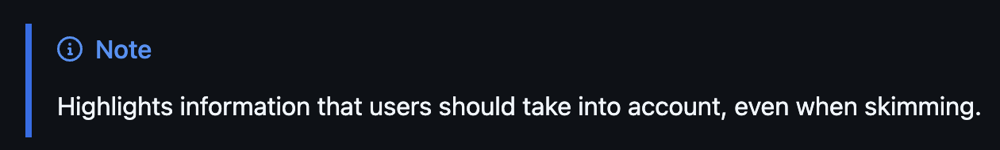
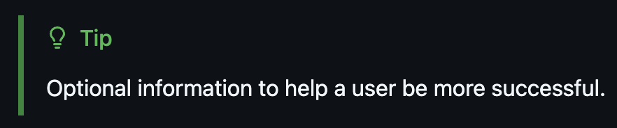
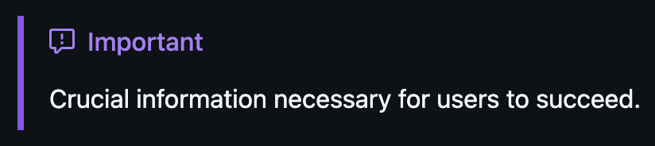
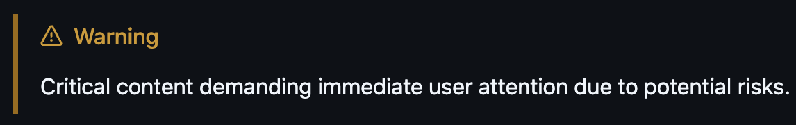
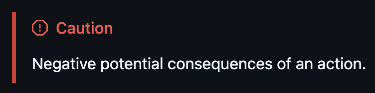

## 마크다운 꿀팁 템플릿

좋은게 있다면 자유롭게 추가합시당

<br />

### 노티 박스

> [!NOTE]
> Highlights information that users should take into account, even when skimming. <br />
> 

> [!TIP]
> Optional information to help a user be more successful. <br />
> 

> [!IMPORTANT]
> Crucial information necessary for users to succeed. <br />
> 

> [!WARNING]
> Critical content demanding immediate user attention due to potential risks. <br />
> 

> [!CAUTION]
> Negative potential consequences of an action. <br />
> 

<br />

### 코드 블록

#### Typescript

```ts

```

#### Javascript

```js

```

#### C++

```cpp

```
